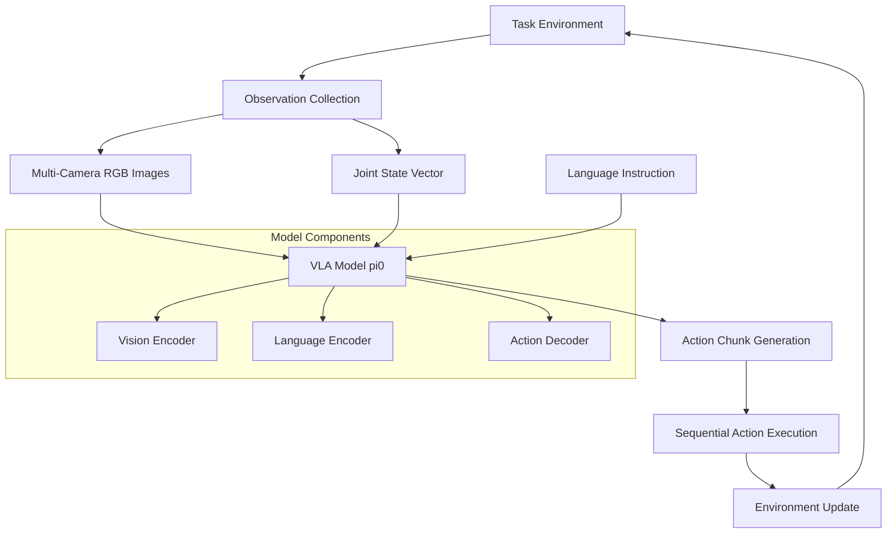

# RoboTwin VLA Evaluation Pipeline Documentation

## Useful Documentations

- RoboTwin2 Official Doc: https://robotwin-platform.github.io/doc/usage/index.html
- DeepWiki: https://deepwiki.com/RoboTwin-Platform/RoboTwin

## Overview

RoboTwin is a comprehensive bimanual robotic manipulation platform that supports various Vision-Language-Action (VLA) models for robotic policy evaluation. This documentation focuses on the VLA evaluation pipeline, particularly the PI0 model deployment framework.

## Key Features

- **Multi-Modal Input Processing**: Handles RGB images from multiple cameras (head, left, right) and joint state information
- **Language-Conditioned Policies**: Supports natural language instructions for task specification
- **Hierarchical Action Generation**: Processes action chunks for efficient robot control
- **Flexible Model Architecture**: Supports various VLA models including PI0, ACT, DP3, RDT, and more
- **Domain Randomization**: Robust evaluation across diverse environmental conditions

## System Architecture



## Mathematical Framework

The VLA model processes multi-modal inputs to generate actions:

$$\pi_\theta(a_t | o_t, l) = \text{VLA}(\{I^{head}_t, I^{left}_t, I^{right}_t\}, s_t, l)$$

Where:
- $a_t$: Action at timestep $t$
- $o_t$: Observation including images $I$ and joint state $s_t$
- $l$: Language instruction
- $\theta$: Model parameters

The action generation follows a chunking mechanism:

$$A_{t:t+H} = \text{ActionChunk}(o_t, l, H)$$

Where $H$ is the action horizon (typically 10 steps for PI0).

## Repository Structure

```
policy/pi0/
├── src/                    # Core PI0 implementation
│   └── openpi/
├── examples/              # Usage examples
│   ├── inference.ipynb   # Jupyter notebook demo
│   ├── droid/           # DROID robot integration
│   ├── aloha_sim/       # ALOHA simulation
│   └── aloha_real/      # Real ALOHA robot
├── pi_model.py           # Main PI0 model wrapper
├── deploy_policy.py      # Deployment interface
├── eval.sh              # Evaluation script
└── checkpoints/          # Model checkpoints
```

## Evaluation Pipeline Overview

The evaluation pipeline consists of several key components:

1. **Environment Setup**: Initialize RoboTwin task environment
2. **Model Loading**: Load pre-trained PI0 checkpoints
3. **Observation Processing**: Handle multi-modal sensor data
4. **Action Generation**: Generate action sequences using VLA
5. **Execution**: Apply actions to robot in simulation/reality
6. **Assessment**: Evaluate task completion and success metrics

## Supported Models

| Model | Type | Features |
|-------|------|----------|
| PI0 | Base VLA | Multi-modal, language-conditioned |
| PI0-FAST | Optimized VLA | Faster inference, flow action decoding |
| ACT | Action Chunking | Transformer-based action prediction |
| DP3 | Diffusion Policy | Diffusion-based action generation |
| RDT | Robot Diffusion | Transformer + diffusion hybrid |

## Next Steps

This documentation is organized into the following chapters:

- [Chapter 2: Environment Setup](./02-environment-setup.md)
- [Chapter 3: PI0 Model Architecture](./03-pi0-architecture.md) 
- [Chapter 4: Deployment Framework](./04-deployment-framework.md)
- [Chapter 5: Evaluation Pipeline](./05-evaluation-pipeline.md)
- [Chapter 6: Hierarchical Modifications](./06-hierarchical-modifications.md)