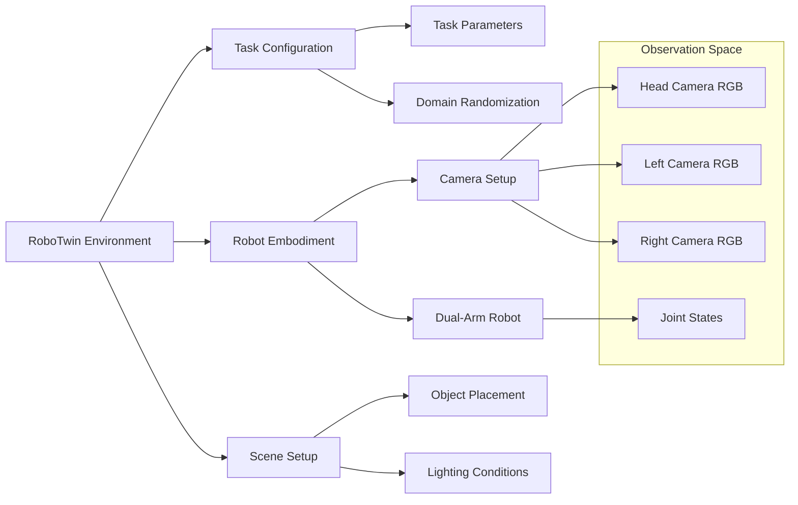
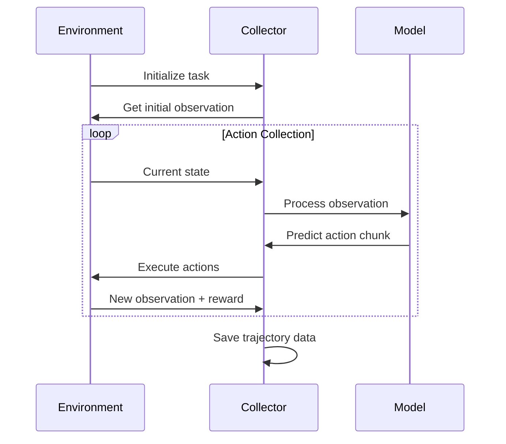

# Chapter 2: Environment Setup

## RoboTwin Task Environment

The RoboTwin platform provides a sophisticated simulation environment for bimanual robotic manipulation tasks. The environment setup is crucial for VLA policy evaluation.

## Environment Architecture



## Key Components

### 1. Task Configuration System

Tasks in RoboTwin are defined through configuration files that specify:

- **Task objectives**: Goal conditions and success criteria
- **Object configurations**: Types, positions, and properties
- **Domain randomization**: Variation ranges for robust evaluation
- **Evaluation metrics**: Success rate, completion time, trajectory quality

### 2. Multi-Camera Observation

The system captures observations from three RGB cameras:

```python
observation_space = {
    "head_camera": {"rgb": (224, 224, 3)},
    "left_camera": {"rgb": (224, 224, 3)}, 
    "right_camera": {"rgb": (224, 224, 3)},
    "joint_action": {"vector": (14,)}  # 7 DOF per arm
}
```

### 3. Action Space

The robot action space consists of:
- **Joint velocities**: 7 DOF per arm (14 total)
- **Gripper commands**: Binary open/close for each gripper
- **Action chunking**: Sequential execution of predicted action sequences

## Data Collection Pipeline

The data collection process follows this workflow:



### Collection Script Analysis

The `collect_data.sh` script orchestrates the data collection:

```bash
#!/bin/bash
task_name=${1}      # e.g., "beat_block_hammer"
task_config=${2}    # e.g., "demo_randomized" 
gpu_id=${3}         # GPU device ID

export CUDA_VISIBLE_DEVICES=${gpu_id}
PYTHONWARNINGS=ignore::UserWarning \
python script/collect_data.py $task_name $task_config
```

Key features:
- **GPU allocation**: Ensures proper GPU utilization
- **Warning suppression**: Clean execution logs
- **Flexible task specification**: Supports various task/config combinations

## Environment Configuration

### Task Parameters

Tasks support extensive configuration options:

```yaml
task_config:
  domain_randomization:
    lighting: [0.3, 1.0]        # Light intensity range
    camera_pose: [±5°, ±5°]     # Camera angle variation
    object_texture: random      # Material randomization
    object_scale: [0.8, 1.2]    # Size variation
  
  success_criteria:
    position_threshold: 0.05    # 5cm position tolerance
    orientation_threshold: 15°   # 15° orientation tolerance
    completion_time: 300        # Maximum 300 timesteps
```

### Embodiment Support

RoboTwin supports multiple robot embodiments:

| Robot | DOF | Gripper Type | Workspace |
|-------|-----|--------------|-----------|
| Panda (dual) | 7+7 | Parallel jaw | 0.8m × 0.8m |
| UR5e (dual) | 6+6 | Custom | 1.0m × 1.0m |
| Kinova (dual) | 7+7 | 3-finger | 0.9m × 0.9m |

## Environment API

### Core Methods

```python
class RoboTwinEnvironment:
    def get_obs(self) -> Dict:
        """Get current multi-modal observation"""
        
    def take_action(self, action: np.ndarray) -> None:
        """Execute single action step"""
        
    def get_instruction(self) -> str:
        """Get natural language task description"""
        
    def reset(self) -> Dict:
        """Reset environment for new episode"""
        
    def is_success(self) -> bool:
        """Check if task is completed successfully"""
```

### Observation Processing

The environment provides structured observations that VLA models can directly consume:

```python
def encode_obs(observation):
    """Extract and format observation for VLA models"""
    input_rgb_arr = [
        observation["observation"]["head_camera"]["rgb"],
        observation["observation"]["right_camera"]["rgb"], 
        observation["observation"]["left_camera"]["rgb"],
    ]
    input_state = observation["joint_action"]["vector"]
    return input_rgb_arr, input_state
```

## Domain Randomization

RoboTwin implements comprehensive domain randomization to ensure robust policy evaluation:

### Visual Randomization
- **Lighting conditions**: Ambient and directional light variation
- **Camera parameters**: Position, orientation, focal length
- **Object appearances**: Textures, colors, materials
- **Background scenes**: Various environmental contexts

### Physical Randomization  
- **Object properties**: Mass, friction, elasticity
- **Robot dynamics**: Joint stiffness, actuator noise
- **Environmental forces**: Gravity variation, air resistance

This randomization ensures that VLA policies generalize well across diverse real-world conditions.