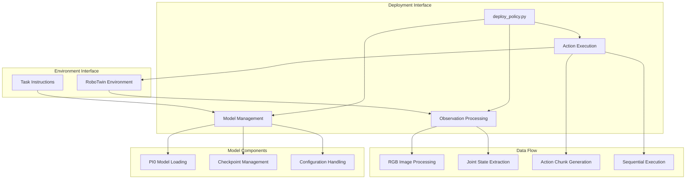
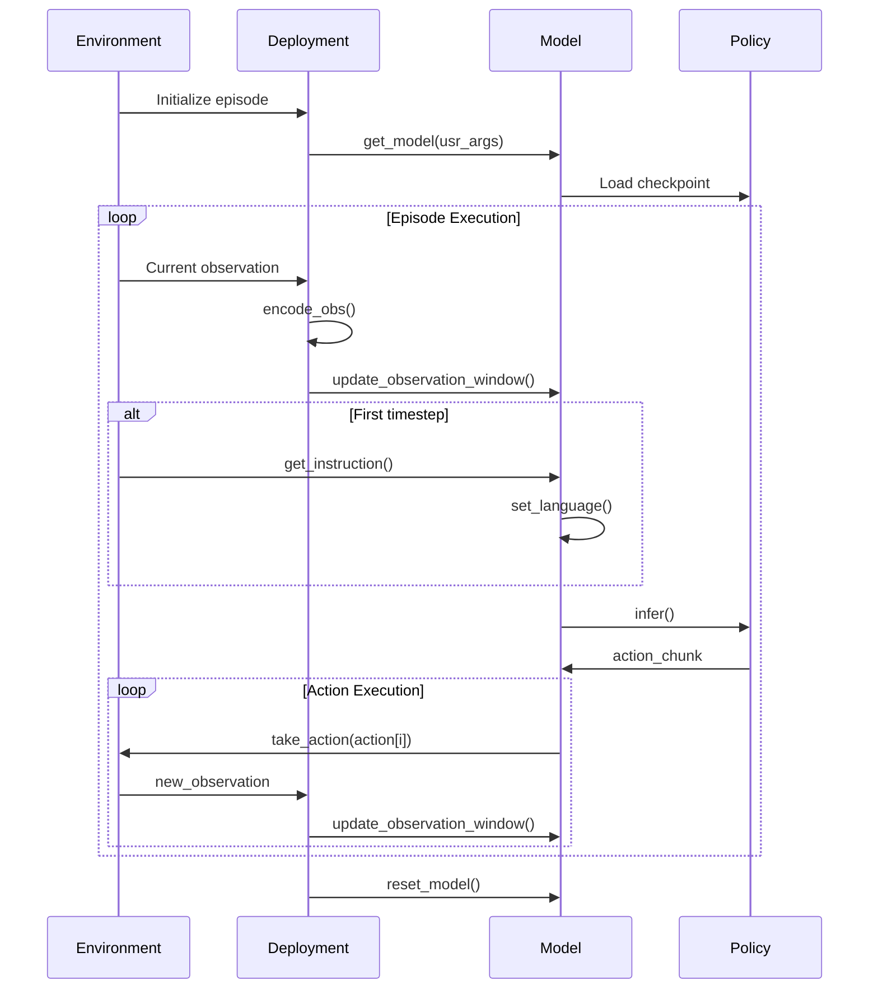

# Chapter 4: Deployment Framework

## Overview

The PI0 deployment framework provides a standardized interface for integrating VLA models with RoboTwin environments. The `deploy_policy.py` module serves as the primary deployment interface, handling model initialization, observation processing, and action execution.

## Deployment Architecture



## Core Functions Analysis

### 1. Observation Encoding

```python
def encode_obs(observation):
    """
    Encode observation for the model
    
    Extracts multi-modal data from RoboTwin observation format
    and converts it to PI0-compatible format.
    """
    input_rgb_arr = [
        observation["observation"]["head_camera"]["rgb"],    # Front view
        observation["observation"]["right_camera"]["rgb"],   # Right wrist
        observation["observation"]["left_camera"]["rgb"],    # Left wrist
    ]
    input_state = observation["joint_action"]["vector"]     # 14-DOF joint state
    
    return input_rgb_arr, input_state
```

**Key Features:**
- **Multi-camera support**: Handles three camera viewpoints
- **Joint state extraction**: 14-DOF dual-arm configuration
- **Format standardization**: Converts RoboTwin format to PI0 format

### 2. Model Initialization

```python
def get_model(usr_args):
    """
    Initialize PI0 model with user-specified configuration
    
    Args:
        usr_args: Dictionary containing:
            - train_config_name: Training configuration identifier
            - model_name: Model type/variant
            - checkpoint_id: Specific checkpoint version
            - pi0_step: Action execution steps per inference
    """
    train_config_name, model_name, checkpoint_id, pi0_step = (
        usr_args["train_config_name"], 
        usr_args["model_name"],
        usr_args["checkpoint_id"], 
        usr_args["pi0_step"]
    )
    return PI0(train_config_name, model_name, checkpoint_id, pi0_step)
```

**Configuration Parameters:**
- `train_config_name`: Links to specific training setup (e.g., "pi0_aloha_sim")
- `model_name`: Identifies model variant (e.g., "pi0_base", "pi0_fast")  
- `checkpoint_id`: Version control for model weights
- `pi0_step`: Controls action chunking granularity

### 3. Evaluation Loop

```python
def eval(TASK_ENV, model, observation):
    """
    Main evaluation function executing the VLA policy
    
    Flow:
    1. Initialize language instruction (first call only)
    2. Process current observation
    3. Generate action chunk
    4. Execute actions sequentially
    5. Update observation buffer
    """
    
    # Initialize instruction on first call
    if model.observation_window is None:
        instruction = TASK_ENV.get_instruction()
        model.set_language(instruction)

    # Process current observation
    input_rgb_arr, input_state = encode_obs(observation)
    model.update_observation_window(input_rgb_arr, input_state)

    # Generate and execute action sequence
    actions = model.get_action()[:model.pi0_step]
    
    for action in actions:
        TASK_ENV.take_action(action)
        observation = TASK_ENV.get_obs()
        input_rgb_arr, input_state = encode_obs(observation)
        model.update_observation_window(input_rgb_arr, input_state)
```

### 4. Model Reset

```python
def reset_model(model):
    """Reset model state for new episode"""
    model.reset_obsrvationwindows()
```

## Execution Flow

The deployment follows this detailed execution sequence:



## Configuration Management

### User Arguments Structure

```python
usr_args = {
    "train_config_name": "pi0_aloha_sim",    # Training configuration
    "model_name": "pi0_base",                # Model variant
    "checkpoint_id": "latest",               # Checkpoint version
    "pi0_step": 1                           # Actions per inference call
}
```

### Training Configurations

Common training configurations and their purposes:

| Config Name | Purpose | Action Space | Observation |
|-------------|---------|--------------|-------------|
| `pi0_aloha_sim` | ALOHA simulation | 14-DOF dual arm | RGB + proprioception |
| `pi0_droid` | DROID robot | 8-DOF single arm | RGB + proprioception |
| `pi0_libero` | LIBERO benchmark | Variable | RGB + proprioception |
| `pi0_base` | General purpose | Configurable | Multi-modal |

### Checkpoint Organization

```
checkpoints/
├── pi0_aloha_sim/           # Training configuration
│   ├── pi0_base/           # Model variant
│   │   ├── latest/         # Checkpoint version
│   │   ├── v1.0/
│   │   └── v2.0/
│   └── pi0_fast/
│       ├── latest/
│       └── v1.0/
```

## Action Chunking Strategy

### Chunking Parameters

The action chunking mechanism balances between:
- **Inference frequency**: How often the model is queried
- **Execution smoothness**: Continuous action flow
- **Reactivity**: Response to environmental changes

```python
# Action chunking configuration
action_config = {
    "chunk_size": 10,      # Actions generated per inference
    "execution_steps": 1,   # Actions executed before next inference
    "overlap": 0           # Overlap between consecutive chunks
}
```

### Execution Strategies

| Strategy | pi0_step | Characteristics |
|----------|----------|-----------------|
| **Fine-grained** | 1 | High reactivity, frequent inference |
| **Balanced** | 3-5 | Good balance of efficiency and reactivity |
| **Coarse-grained** | 8-10 | High efficiency, lower reactivity |

## Error Handling

### Common Issues and Solutions

```python
def robust_eval(TASK_ENV, model, observation):
    """Enhanced evaluation with error handling"""
    try:
        # Standard evaluation logic
        eval(TASK_ENV, model, observation)
        
    except AssertionError as e:
        if "update observation_window first" in str(e):
            # Handle uninitialized observation window
            input_rgb_arr, input_state = encode_obs(observation)
            model.update_observation_window(input_rgb_arr, input_state)
            
    except RuntimeError as e:
        if "CUDA out of memory" in str(e):
            # Handle GPU memory issues
            torch.cuda.empty_cache()
            model = reload_model_with_reduced_batch()
            
    except Exception as e:
        # Log error and continue with safe fallback
        logging.error(f"Policy evaluation error: {e}")
        return fallback_action()
```

### Monitoring and Debugging

```python
def debug_deployment(model, observation):
    """Debug utilities for deployment issues"""
    print(f"Observation window initialized: {model.observation_window is not None}")
    print(f"Language instruction set: {hasattr(model, 'instruction')}")
    print(f"Image shapes: {[img.shape for img in observation['observation'].values()]}")
    print(f"Joint state shape: {observation['joint_action']['vector'].shape}")
```

This deployment framework provides a robust, flexible interface for integrating PI0 models with diverse robotic environments while maintaining consistent performance and reliability.