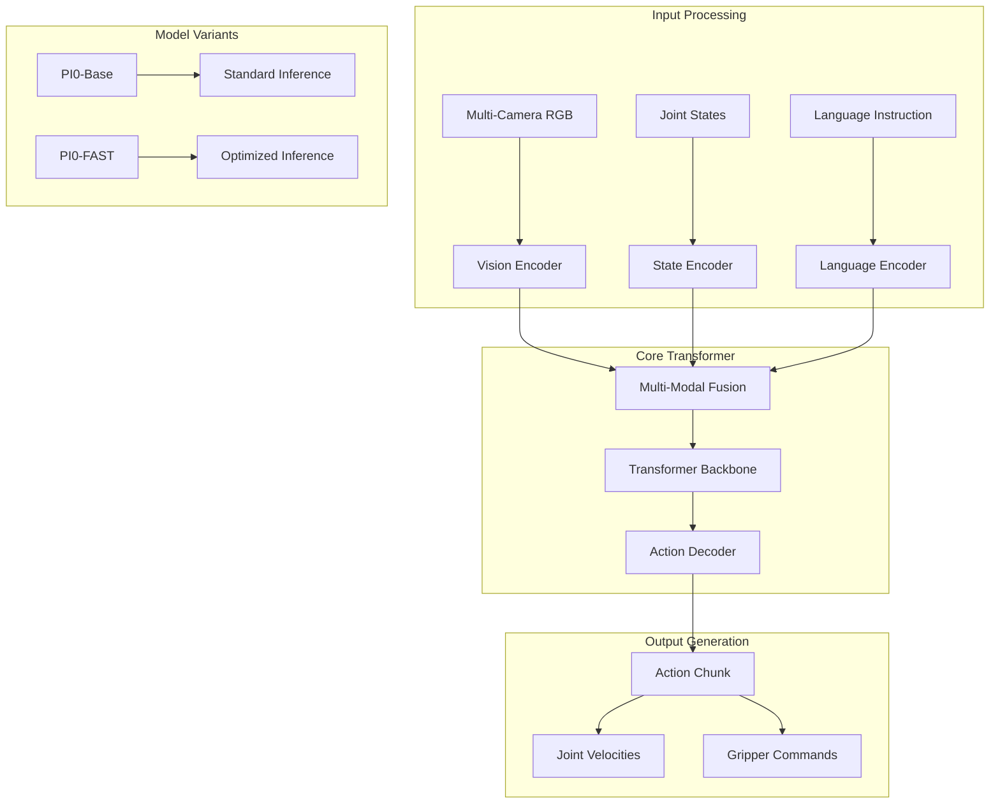
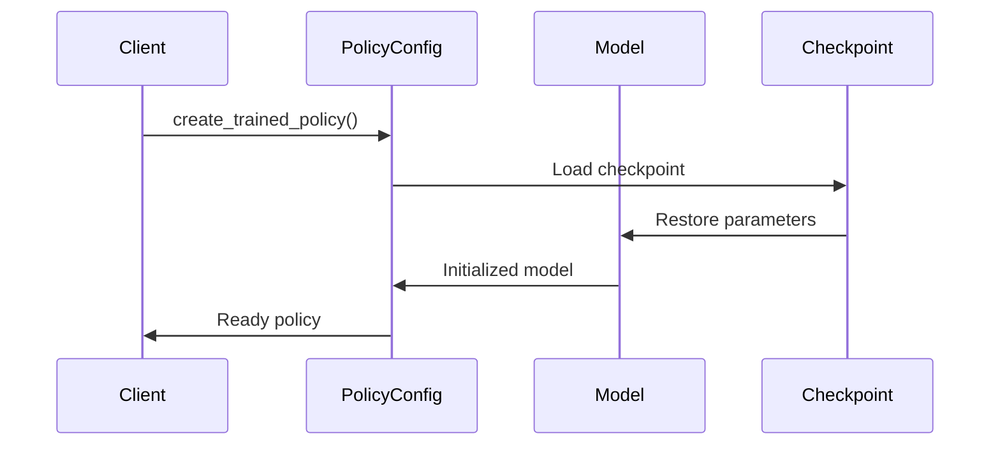

# Chapter 3: PI0 Model Architecture

## Overview

PI0 (Physical Intelligence Zero) is a foundational Vision-Language-Action model designed for robotic manipulation. It processes multi-modal inputs (vision, language, proprioception) to generate action sequences for robotic control.

## Model Architecture



## Mathematical Foundation

### Multi-Modal Encoding

The PI0 model processes inputs through specialized encoders:

**Vision Encoding:**
$$\mathbf{v}_t = \text{VisionEncoder}(\{I^{head}_t, I^{left}_t, I^{right}_t\})$$

**State Encoding:**
$$\mathbf{s}_t = \text{StateEncoder}(\mathbf{q}_t, \dot{\mathbf{q}}_t)$$

**Language Encoding:**
$$\mathbf{l} = \text{LanguageEncoder}(\text{instruction})$$

### Fusion and Action Generation

The encoded features are fused and processed through a transformer:

$$\mathbf{h}_t = \text{Transformer}([\mathbf{v}_t; \mathbf{s}_t; \mathbf{l}])$$

Action chunks are generated autoregressively:

$$A_{t:t+H} = \text{ActionDecoder}(\mathbf{h}_t, H)$$

Where $H$ is the action horizon (typically 10 for PI0).

## PI0 Class Implementation

### Core Components

```python
class PI0:
    def __init__(self, train_config_name, model_name, checkpoint_id, pi0_step):
        """
        Initialize PI0 model wrapper
        
        Args:
            train_config_name: Configuration name (e.g., "pi0_aloha_sim")
            model_name: Model identifier for checkpoint loading
            checkpoint_id: Specific checkpoint version
            pi0_step: Number of actions to execute per inference
        """
        self.train_config_name = train_config_name
        self.model_name = model_name
        self.checkpoint_id = checkpoint_id
        self.pi0_step = pi0_step
        
        # Load configuration and create policy
        config = _config.get_config(self.train_config_name)
        self.policy = _policy_config.create_trained_policy(
            config,
            f"policy/pi0/checkpoints/{self.train_config_name}/{self.model_name}/{self.checkpoint_id}",
            robotwin_repo_id=model_name
        )
        
        # Initialize observation window buffer
        self.observation_window = None
        self.img_size = (224, 224)
```

### Key Methods

#### 1. Language Instruction Setting

```python
def set_language(self, instruction):
    """Set natural language instruction for the task"""
    self.instruction = instruction
    print(f"Successfully set instruction: {instruction}")
```

#### 2. Observation Window Management

```python
def update_observation_window(self, img_arr, state):
    """
    Update the observation buffer with current sensor data
    
    Args:
        img_arr: List of [front, right, left] camera images
        state: Joint state vector (14-dim for dual-arm)
    """
    img_front, img_right, img_left, puppet_arm = (
        img_arr[0], img_arr[1], img_arr[2], state,
    )
    
    # Transpose images from HWC to CHW format
    img_front = np.transpose(img_front, (2, 0, 1))
    img_right = np.transpose(img_right, (2, 0, 1))
    img_left = np.transpose(img_left, (2, 0, 1))

    self.observation_window = {
        "state": state,
        "images": {
            "cam_high": img_front,        # Head camera
            "cam_left_wrist": img_left,   # Left wrist camera
            "cam_right_wrist": img_right, # Right wrist camera
        },
        "prompt": self.instruction,
    }
```

#### 3. Action Generation

```python
def get_action(self):
    """Generate action chunk from current observation"""
    assert self.observation_window is not None, "Update observation_window first!"
    return self.policy.infer(self.observation_window)["actions"]
```

## Model Variants

### PI0-Base vs PI0-FAST

| Feature | PI0-Base | PI0-FAST |
|---------|----------|----------|
| Architecture | Standard Transformer | Optimized with FAST tokenizer |
| Inference Speed | ~100ms | ~50ms |
| Action Decoding | Flow-based | Direct prediction |
| Memory Usage | Higher | Lower |
| Performance | Better accuracy | Faster execution |

### Configuration Examples

```python
# PI0-Base Configuration
config_base = {
    "model_type": "pi0_base",
    "action_horizon": 10,
    "vision_encoder": "clip",
    "language_model": "t5-base",
    "action_dim": 14
}

# PI0-FAST Configuration  
config_fast = {
    "model_type": "pi0_fast",
    "action_horizon": 10,
    "vision_encoder": "clip",
    "language_model": "t5-base", 
    "action_dim": 14,
    "fast_tokenizer": True
}
```

## Checkpoint Management

### Checkpoint Structure

```
checkpoints/
├── pi0_aloha_sim/
│   ├── model_name/
│   │   ├── checkpoint_id/
│   │   │   ├── params          # Model parameters
│   │   │   ├── config.json     # Training configuration
│   │   │   └── metadata.json   # Model metadata
```

### Loading Process

The model loading follows this sequence:



## Input/Output Specifications

### Input Format

```python
observation_input = {
    "images": {
        "cam_high": np.array([3, 224, 224]),      # CHW format
        "cam_left_wrist": np.array([3, 224, 224]),
        "cam_right_wrist": np.array([3, 224, 224])
    },
    "state": np.array([14]),                      # Joint positions
    "prompt": "pick up the red block"             # Natural language
}
```

### Output Format

```python
action_output = {
    "actions": np.array([10, 14])  # [horizon, action_dim]
}
# Where action_dim = 7 (left arm) + 7 (right arm) joint velocities
```

## Memory and Performance

### GPU Memory Usage

- **Model size**: ~2.5GB for PI0-Base, ~1.8GB for PI0-FAST  
- **Inference memory**: ~4GB peak during forward pass
- **Recommended GPU**: NVIDIA RTX 4090 or better

### Inference Timing

| Component | PI0-Base | PI0-FAST |
|-----------|----------|----------|
| Vision encoding | 25ms | 15ms |
| Language encoding | 10ms | 8ms |
| Transformer forward | 50ms | 20ms |
| Action decoding | 15ms | 7ms |
| **Total** | **100ms** | **50ms** |

This architecture enables real-time robotic control while maintaining high-quality action generation capabilities.