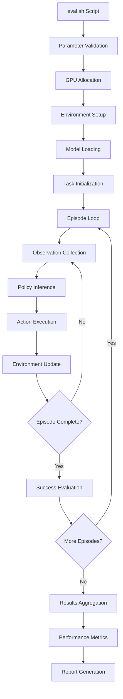

# Chapter 5: Evaluation Pipeline

## Overview

The evaluation pipeline orchestrates the complete process of testing VLA policies in RoboTwin environments. The `eval.sh` script serves as the entry point, coordinating GPU allocation, environment setup, and policy execution.

## Evaluation Script Analysis

### Script Structure

```bash
#!/bin/bash

policy_name=pi0
task_name=${1}           # e.g., "beat_block_hammer"
task_config=${2}         # e.g., "demo_randomized"
train_config_name=${3}   # e.g., "pi0_aloha_sim"
model_name=${4}          # e.g., "pi0_base"
seed=${5}                # Random seed for reproducibility
gpu_id=${6}              # GPU device selection

export CUDA_VISIBLE_DEVICES=${gpu_id}
export XLA_PYTHON_CLIENT_MEM_FRACTION=0.4  # GPU memory management

source .venv/bin/activate
cd ../.. # Navigate to repository root

PYTHONWARNINGS=ignore::UserWarning \
python script/eval_policy.py --config policy/$policy_name/deploy_policy.yml \
    --overrides \
    --task_name ${task_name} \
    --task_config ${task_config} \
    --train_config_name ${train_config_name} \
    --model_name ${model_name} \
    --ckpt_setting ${model_name} \
    --seed ${seed} \
    --policy_name ${policy_name}
```

### Key Features

1. **GPU Memory Management**: `XLA_PYTHON_CLIENT_MEM_FRACTION=0.4` ensures the model uses only 40% of GPU memory, preventing OOM errors
2. **Environment Isolation**: Virtual environment activation ensures dependency consistency
3. **Warning Suppression**: Clean execution logs by filtering user warnings
4. **Flexible Configuration**: Command-line parameter passing for different evaluation scenarios

## Evaluation Workflow



## Configuration System

### YAML Configuration Structure

```yaml
# deploy_policy.yml
policy_config:
  name: "pi0"
  checkpoint_path: "policy/pi0/checkpoints/"
  
model_args:
  train_config_name: null    # Set via command line
  model_name: null          # Set via command line
  checkpoint_id: "latest"
  pi0_step: 1

evaluation:
  max_episodes: 100
  max_timesteps: 300
  success_threshold: 0.95
  
environment:
  render: false
  record_video: true
  domain_randomization: true
```

### Command Line Overrides

The evaluation system supports dynamic configuration through command-line parameters:

```python
# Example parameter mapping
params = {
    "--task_name": "beat_block_hammer",
    "--task_config": "demo_randomized", 
    "--train_config_name": "pi0_aloha_sim",
    "--model_name": "pi0_base",
    "--seed": 42,
    "--policy_name": "pi0"
}
```

## Evaluation Metrics

### Success Metrics

The evaluation system tracks multiple performance indicators:

```python
evaluation_metrics = {
    "success_rate": 0.85,           # Percentage of successful episodes
    "average_steps": 145.2,         # Mean timesteps to completion
    "completion_time": 12.4,        # Average episode duration (seconds)
    "action_smoothness": 0.92,      # Action trajectory quality
    "language_following": 0.88      # Instruction adherence score
}
```

### Performance Analysis

| Metric | Description | Target Range |
|--------|-------------|--------------|
| Success Rate | Task completion percentage | > 80% |
| Average Steps | Timesteps to task completion | < 200 |
| Completion Time | Real-time episode duration | < 30s |
| Action Smoothness | Trajectory continuity measure | > 0.8 |
| Language Following | Instruction adherence | > 0.85 |

## Multi-Task Evaluation

### Task Configuration Matrix

```python
evaluation_tasks = {
    "manipulation": [
        ("pick_and_place", "demo_randomized"),
        ("stack_blocks", "hard_randomized"),
        ("open_drawer", "demo_randomized")
    ],
    "bimanual": [
        ("beat_block_hammer", "demo_randomized"),
        ("dual_arm_lift", "hard_randomized"),
        ("cooperative_assembly", "demo_randomized")
    ],
    "tool_use": [
        ("hammer_nail", "demo_randomized"),
        ("screw_driver", "hard_randomized"),
        ("cut_with_knife", "demo_randomized")
    ]
}
```

### Batch Evaluation Script

```bash
#!/bin/bash
# batch_eval.sh - Evaluate across multiple tasks

tasks=("beat_block_hammer" "pick_and_place" "stack_blocks")
configs=("demo_randomized" "hard_randomized")
seeds=(1 2 3 4 5)

for task in "${tasks[@]}"; do
    for config in "${configs[@]}"; do
        for seed in "${seeds[@]}"; do
            echo "Evaluating: $task/$config/seed_$seed"
            bash eval.sh $task $config pi0_aloha_sim pi0_base $seed 0
        done
    done
done
```

## Results Analysis

### Statistical Evaluation

The evaluation pipeline generates comprehensive statistics:

```python
def analyze_results(results_dir):
    """Analyze evaluation results across multiple runs"""
    
    metrics = {}
    for task in os.listdir(results_dir):
        task_results = load_task_results(f"{results_dir}/{task}")
        
        metrics[task] = {
            "mean_success": np.mean(task_results["success"]),
            "std_success": np.std(task_results["success"]),
            "median_steps": np.median(task_results["steps"]),
            "confidence_interval": compute_ci(task_results["success"])
        }
    
    return metrics
```

### Visualization Dashboard

```python
def create_evaluation_dashboard(metrics):
    """Generate evaluation dashboard with key metrics"""
    
    dashboard = {
        "success_rate_heatmap": plot_success_matrix(metrics),
        "efficiency_trends": plot_step_distribution(metrics),
        "robustness_analysis": plot_domain_randomization_impact(metrics),
        "comparative_analysis": plot_model_comparison(metrics)
    }
    
    save_dashboard(dashboard, "evaluation_report.html")
```

## Debugging and Monitoring

### Real-time Monitoring

```python
class EvaluationMonitor:
    def __init__(self):
        self.episode_count = 0
        self.success_count = 0
        self.current_metrics = {}
    
    def update(self, episode_result):
        """Update monitoring metrics"""
        self.episode_count += 1
        if episode_result["success"]:
            self.success_count += 1
        
        # Real-time success rate
        current_sr = self.success_count / self.episode_count
        print(f"Episode {self.episode_count}: Success Rate = {current_sr:.3f}")
        
        # Early stopping condition
        if self.episode_count > 20 and current_sr < 0.1:
            print("WARNING: Very low success rate detected!")
```

### Error Recovery

```python
def robust_evaluation(task_name, task_config, model_args):
    """Evaluation with automatic error recovery"""
    
    max_retries = 3
    retry_count = 0
    
    while retry_count < max_retries:
        try:
            results = run_evaluation(task_name, task_config, model_args)
            return results
            
        except RuntimeError as e:
            if "CUDA out of memory" in str(e):
                torch.cuda.empty_cache()
                model_args["batch_size"] = model_args.get("batch_size", 1) // 2
                retry_count += 1
            else:
                raise e
    
    raise RuntimeError(f"Evaluation failed after {max_retries} retries")
```

## Performance Optimization

### GPU Memory Management

```bash
# Memory optimization strategies
export XLA_PYTHON_CLIENT_MEM_FRACTION=0.4    # Limit JAX memory usage
export CUDA_VISIBLE_DEVICES=0                # Single GPU allocation
export TF_FORCE_GPU_ALLOW_GROWTH=true       # Dynamic memory allocation
```

### Parallel Evaluation

```python
def parallel_evaluation(task_configs, num_workers=4):
    """Run evaluations in parallel across multiple GPUs"""
    
    with multiprocessing.Pool(num_workers) as pool:
        results = pool.starmap(
            run_single_evaluation,
            [(config, gpu_id % 4) for gpu_id, config in enumerate(task_configs)]
        )
    
    return aggregate_results(results)
```

This evaluation pipeline ensures comprehensive, reproducible testing of VLA policies across diverse manipulation tasks while providing detailed performance analytics and robust error handling.