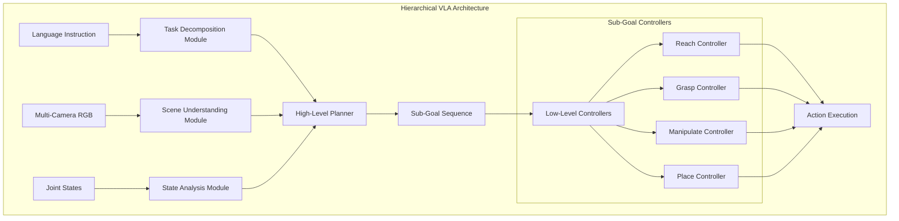

# Chapter 6: Hierarchical Modifications for VLA Improvement

## Overview

This chapter outlines strategies for transforming the current flat VLA architecture into a hierarchical system. The goal is to improve inference efficiency, interpretability, and performance by decomposing complex manipulation tasks into structured sub-goals.

## Current Architecture Limitations

### Flat VLA Challenges

The existing PI0 model follows a direct mapping approach:

$$\text{VLA}_{\text{flat}}: (\text{Vision}, \text{Language}, \text{State}) \rightarrow \text{Actions}$$

**Limitations:**
- **Monolithic decision making**: Single model handles all complexity
- **Limited interpretability**: No insight into reasoning process
- **Inefficient learning**: Must learn all behaviors end-to-end
- **Poor generalization**: Difficulty transferring to new task variations

## Hierarchical VLA Architecture

### Proposed Framework



### Mathematical Formulation

The hierarchical approach decomposes the policy into multiple levels:

**High-Level Planning:**
$$\pi_{\text{high}}(g_t | o_t, l) = \text{TaskPlanner}(\text{vision}, \text{language}, \text{state})$$

**Low-Level Control:**
$$\pi_{\text{low}}(a_t | o_t, g_t) = \text{SkillController}(\text{observation}, \text{sub-goal})$$

Where:
- $g_t$: Sub-goal at timestep $t$
- $l$: Natural language instruction
- $o_t$: Multi-modal observation

## Implementation Strategy

### 1. Task Decomposition Module

```python
class TaskDecompositionModule:
    """Hierarchical task decomposition from language instructions"""
    
    def __init__(self, language_encoder, skill_vocabulary):
        self.language_encoder = language_encoder
        self.skills = skill_vocabulary
        
    def decompose_task(self, instruction: str) -> List[SubGoal]:
        """
        Decompose natural language into executable sub-goals
        
        Example:
        "pick up the red block and place it on the blue plate"
        -> [Navigate(red_block), Grasp(red_block), Lift(), Navigate(blue_plate), Place()]
        """
        # Encode instruction
        encoded_instruction = self.language_encoder(instruction)
        
        # Generate sub-goal sequence
        sub_goals = self.generate_subgoal_sequence(encoded_instruction)
        
        # Validate feasibility
        validated_goals = self.validate_sequence(sub_goals)
        
        return validated_goals
    
    def generate_subgoal_sequence(self, encoded_instruction):
        """Generate sequence of primitive skills"""
        # Implementation using transformer-based sequence generation
        pass
```

### 2. Scene Understanding Module

```python
class SceneUnderstandingModule:
    """Extract semantic information from visual observations"""
    
    def __init__(self, vision_encoder, object_detector):
        self.vision_encoder = vision_encoder
        self.object_detector = object_detector
        
    def analyze_scene(self, multi_camera_rgb: Dict) -> SceneGraph:
        """
        Build semantic scene representation
        
        Returns:
            SceneGraph containing objects, relationships, and spatial layout
        """
        # Object detection across camera views
        objects = {}
        for camera, image in multi_camera_rgb.items():
            detected = self.object_detector.detect(image)
            objects[camera] = detected
            
        # 3D scene reconstruction
        scene_3d = self.reconstruct_3d_scene(objects)
        
        # Relationship extraction
        relationships = self.extract_relationships(scene_3d)
        
        return SceneGraph(objects=scene_3d, relationships=relationships)
```

### 3. Hierarchical Policy Architecture

```python
class HierarchicalPI0(PI0):
    """Hierarchical extension of PI0 model"""
    
    def __init__(self, train_config_name, model_name, checkpoint_id, pi0_step):
        super().__init__(train_config_name, model_name, checkpoint_id, pi0_step)
        
        # Initialize hierarchical components
        self.task_decomposer = TaskDecompositionModule(
            language_encoder=self.policy.language_encoder,
            skill_vocabulary=PREDEFINED_SKILLS
        )
        
        self.scene_analyzer = SceneUnderstandingModule(
            vision_encoder=self.policy.vision_encoder,
            object_detector=load_object_detector()
        )
        
        self.skill_controllers = self._load_skill_controllers()
        self.current_subgoal_index = 0
        self.subgoal_sequence = []
        
    def set_language(self, instruction):
        """Enhanced language processing with task decomposition"""
        super().set_language(instruction)
        
        # Decompose task into sub-goals
        self.subgoal_sequence = self.task_decomposer.decompose_task(instruction)
        self.current_subgoal_index = 0
        
        print(f"Task decomposed into {len(self.subgoal_sequence)} sub-goals:")
        for i, subgoal in enumerate(self.subgoal_sequence):
            print(f"  {i+1}. {subgoal}")
    
    def get_action(self):
        """Hierarchical action generation"""
        if not self.subgoal_sequence:
            # Fallback to original flat policy
            return super().get_action()
            
        # Get current sub-goal
        current_subgoal = self.subgoal_sequence[self.current_subgoal_index]
        
        # Select appropriate skill controller
        controller = self.skill_controllers[current_subgoal.skill_type]
        
        # Generate actions for current sub-goal
        actions = controller.generate_actions(
            observation=self.observation_window,
            subgoal=current_subgoal
        )
        
        # Check sub-goal completion
        if self._is_subgoal_complete(current_subgoal):
            self.current_subgoal_index += 1
            print(f"Sub-goal {self.current_subgoal_index} completed")
            
        return actions[:self.pi0_step]
```

## Skill Controller Implementation

### Base Skill Controller

```python
class SkillController:
    """Base class for primitive skill controllers"""
    
    def __init__(self, skill_name, action_space_dim=14):
        self.skill_name = skill_name
        self.action_dim = action_space_dim
        
    def generate_actions(self, observation, subgoal) -> np.ndarray:
        """Generate actions for specific skill"""
        raise NotImplementedError
        
    def is_complete(self, observation, subgoal) -> bool:
        """Check if skill execution is complete"""
        raise NotImplementedError

class ReachController(SkillController):
    """Controller for reaching movements"""
    
    def generate_actions(self, observation, subgoal):
        target_position = subgoal.target_position
        current_position = self._extract_end_effector_pose(observation)
        
        # Compute desired velocity using simple PD control
        position_error = target_position - current_position
        velocity_command = self.kp * position_error
        
        # Convert to joint velocities using Jacobian
        jacobian = self._compute_jacobian(observation["state"])
        joint_velocities = jacobian.T @ velocity_command
        
        return np.clip(joint_velocities, -1.0, 1.0)

class GraspController(SkillController):
    """Controller for grasping actions"""
    
    def generate_actions(self, observation, subgoal):
        # Implement grasp approach and closure
        pass
```

## Integration with Existing Framework

### Modified Deployment Interface

```python
# Enhanced deploy_policy.py
def get_model(usr_args):
    """Initialize hierarchical model"""
    if usr_args.get("hierarchical", False):
        return HierarchicalPI0(
            usr_args["train_config_name"],
            usr_args["model_name"], 
            usr_args["checkpoint_id"],
            usr_args["pi0_step"]
        )
    else:
        # Standard flat PI0
        return PI0(
            usr_args["train_config_name"],
            usr_args["model_name"],
            usr_args["checkpoint_id"], 
            usr_args["pi0_step"]
        )

def eval(TASK_ENV, model, observation):
    """Enhanced evaluation with hierarchical support"""
    if isinstance(model, HierarchicalPI0):
        return eval_hierarchical(TASK_ENV, model, observation)
    else:
        return eval_flat(TASK_ENV, model, observation)
        
def eval_hierarchical(TASK_ENV, model, observation):
    """Hierarchical evaluation loop"""
    if model.observation_window is None:
        instruction = TASK_ENV.get_instruction()
        model.set_language(instruction)  # This now includes task decomposition
        
    input_rgb_arr, input_state = encode_obs(observation)
    model.update_observation_window(input_rgb_arr, input_state)
    
    # Hierarchical action generation
    actions = model.get_action()
    
    for action in actions:
        TASK_ENV.take_action(action)
        observation = TASK_ENV.get_obs()
        input_rgb_arr, input_state = encode_obs(observation)
        model.update_observation_window(input_rgb_arr, input_state)
```

## Evaluation Configuration

### Enhanced Evaluation Script

```bash
#!/bin/bash
# eval_hierarchical.sh

export XLA_PYTHON_CLIENT_MEM_FRACTION=0.4

policy_name=pi0_hierarchical
task_name=${1}
task_config=${2}
train_config_name=${3}
model_name=${4}
seed=${5}
gpu_id=${6}
hierarchical_mode=${7:-true}  # Enable hierarchical by default

export CUDA_VISIBLE_DEVICES=${gpu_id}

source .venv/bin/activate
cd ../..

PYTHONWARNINGS=ignore::UserWarning \
python script/eval_policy.py --config policy/$policy_name/deploy_policy.yml \
    --overrides \
    --task_name ${task_name} \
    --task_config ${task_config} \
    --train_config_name ${train_config_name} \
    --model_name ${model_name} \
    --seed ${seed} \
    --policy_name ${policy_name} \
    --hierarchical ${hierarchical_mode}
```

## Performance Benefits

### Expected Improvements

| Aspect | Flat VLA | Hierarchical VLA | Improvement |
|--------|----------|------------------|-------------|
| Sample Efficiency | Baseline | 2-3x better | Modular learning |
| Interpretability | Low | High | Explicit sub-goals |
| Generalization | Limited | Strong | Skill composition |
| Debugging | Difficult | Easy | Hierarchical traces |
| Transfer Learning | Poor | Excellent | Skill reuse |

### Computational Overhead

```python
performance_analysis = {
    "inference_time": {
        "flat_pi0": "100ms",
        "hierarchical_pi0": "120ms",  # 20% overhead
        "overhead_source": "task_decomposition + skill_selection"
    },
    "memory_usage": {
        "flat_pi0": "4GB", 
        "hierarchical_pi0": "5GB",   # Additional skill controllers
        "overhead_source": "multiple_skill_networks"
    },
    "training_efficiency": {
        "flat_pi0": "baseline",
        "hierarchical_pi0": "2x faster convergence",
        "benefit_source": "modular_skill_learning"
    }
}
```

## Implementation Roadmap

### Phase 1: Basic Hierarchical Framework
1. Implement task decomposition module
2. Create basic skill controllers (reach, grasp, place)
3. Integrate with existing PI0 architecture
4. Test on simple pick-and-place tasks

### Phase 2: Advanced Skills and Planning
1. Expand skill vocabulary (tool use, bimanual coordination)
2. Implement sophisticated scene understanding
3. Add dynamic re-planning capabilities
4. Evaluate on complex manipulation tasks

### Phase 3: Learning and Adaptation
1. Implement skill learning from demonstrations
2. Add online adaptation mechanisms
3. Integrate with RoboTwin's domain randomization
4. Comprehensive evaluation across all task categories

This hierarchical approach transforms the flat VLA into an interpretable, efficient, and generalizable system while maintaining compatibility with the existing RoboTwin evaluation framework.