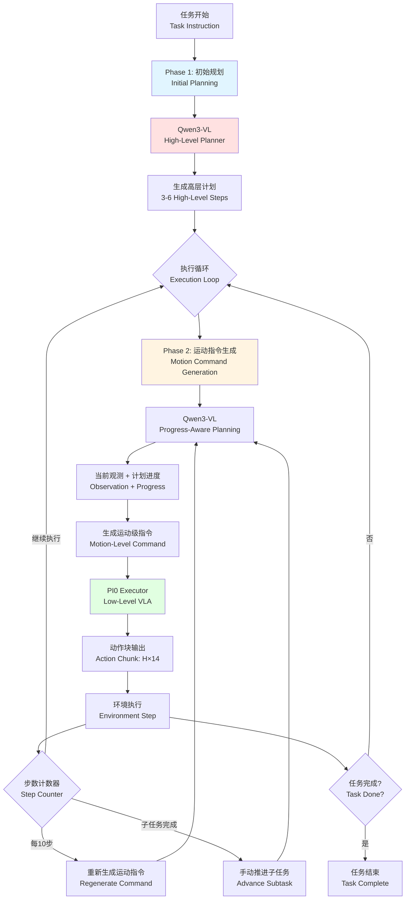

# Group003 项目报告：扁平化与分层VLA策略对比分析

**项目成员:**  叶雷 (镜像搭建以及任务实现)，李毅恒(分层策略以及任务实现), C角 (消融实验以及报告)
**项目周期:** 48小时

---

## I. 项目概览 (Project Overview)

### 1.1. 项目背景与挑战

传统的扁平化VLA（Flat VLA）模型，如`PI0`，采用单一的端到端映射，即 $(\text{Vision}, \text{Language}, \text{State}) \rightarrow \text{Actions}$。这种结构在处理多步骤、长周期的复杂操作任务时，面临以下挑战：

* **可解释性差 (Limited interpretability)**：决策过程是一个“黑盒”，难以调试。
* **学习效率低 (Inefficient learning)**：模型必须从头学习所有行为，难以泛化。
* **泛化能力弱 (Poor generalization)**：难以将学到的技能迁移到新的任务变体中。

### 1.2. 核心任务 (Core Objective)

本项目旨在复现一个扁平化VLA（`PI0`）作为基线（Baseline），并在此基础上，设计、实现并对比两种分层VLA（Hierarchical VLA）策略。

我们将重点评估分层结构在**任务成功率、动作合理性（效率与平滑度）、泛化鲁棒性**方面的提升，并分析其对模型可解释性、样本效率和推理开销的影响。

---

## II. 镜像环境配置、代码管理及数采微调管线搭建

### 2.1. 服务器镜像配置及一键部署 (Environment Setup)

基于原始镜像`25fall-robotwin-h200:vulkan-cuda12.8`，配置新的RoboTwin环境镜像`25fall-masteryip-hier-vla:v1.x_gpu`系列，集成以下组件：

* RoboTwin仿真平台
* Pi0模型代码及依赖
* Hierarchical VLA相关代码及依赖
* 数据采集与处理脚本
此镜像可一键部署，方便团队成员快速搭建环境。


### 2.2. 代码管理与协作 (Code Management)

基于`RoboTwin`开源代码仓库，创建`RoboTwin_HierVLA`新仓库，进行代码版本控制与协作开发。


### 2.3. Xmind思维导图工作流 (Xmind Workflow)

基于Xmind思维导图，规划项目工作流与任务分配，确保各成员明确职责与时间节点。

 

### 2.4. 数据采集与微调管线搭建 (Data Collection & Fine-tuning Pipeline)

> [!NOTE]
> Checkout Pi0 train data gen & training command see <https://robotwin-platform.github.io/doc/usage/Pi0.html#1-environment-setup>

**Data Collection**

```bash
# Under RoboTwin_HierVLA root directory
bash collect_data.sh stack_blocks_three demo_randomized 0
bash collect_data.sh blocks_ranking_rgb demo_randomized 1
```

**Convert Data to pi0 training data**

```bash
# Under RoboTwin_HierVLA/policy/pi0 directory
mkdir processed_data && mkdir training_data
# bash process_data_pi0.sh ${task_name} ${task_config} ${expert_data_num}
bash process_data_pi0.sh stack_blocks_three demo_randomized 50
bash process_data_pi0.sh place_burger_fries demo_randomized 50

# hdf5_path: The path to the generated HDF5 data (e.g., ./training_data/${model_name}/)
# repo_id: The name of the dataset (e.g., my_repo)
# bash generate.sh ${hdf5_path} ${repo_id}
bash generate.sh ./training_data/flatpi0/ flatpi0
```

**Finetune Model**

> In `RoboTwin_HierVLA/policy/pi0/src/openpi/training/config.py`, you only need to write repo_id on your datasets.(e.g., repo_id=demo_clean_repo)

> [!WARNING]
> Change UV source for uv update:
>
> ```bash
> export UV_INDEX_URL=http://nexus.sii.shaipower.online/repository/pypi/simple/
> ```
>
> Update openpi cache path by
>
> ```bash
> export OPENPI_DATA_HOME=../../.cache/openpi
> # Use abs dir
> export OPENPI_DATA_HOME=/inspire/ssd/project/25jinqiu07/public/hiervla_003/RoboTwin_HierVLA/.cache/openpi
> ```
>
> AND you should put `paligemma_tokenizer` and `pi0_base` into the cache folder.

```bash
# compute norm_stat for dataset
# uv run scripts/compute_norm_stats.py --config-name ${train_config_name}
uv run scripts/compute_norm_stats.py --config-name pi0_base_aloha_robotwin_full

# train_config_name: The name corresponding to the config in _CONFIGS, such as pi0_base_aloha_robotwin_full
# model_name: You can choose any name for your model
# gpu_use: if not using multi gpu,set to gpu_id like 0;else set like 0,1,2,3
# bash finetune.sh ${train_config_name} ${model_name} ${gpu_use}
#bash finetune.sh pi0_base_aloha_robotwin_full demo_clean 0,1,2,3
bash finetune.sh pi0_base_aloha_robotwin_full flatpi0 0,1,2,3
```

**Eval Trained Pi0 Model Commands**

```bash
# Under RoboTwin_HierVLA/policy/pi0 directory
# ckpt_path like: policy/pi0/checkpoints/pi0_base_aloha_robotwin_full/demo_clean/30000
bash eval.sh ${task_name} ${task_config} ${train_config_name} ${model_name} ${seed} ${gpu_id}
bash eval.sh place_burger_fries demo_randomized pi0_base_aloha_robotwin_full flatpi0 0 0
# bash eval.sh beat_block_hammer demo_clean pi0_base_aloha_robotwin_full demo_clean 0 0
# This command trains the policy using the `demo_clean` setting ($model_name)
# and evaluates it using the same `demo_clean` setting ($task_config).

# To evaluate a policy trained on the `demo_clean` setting and tested on the `demo_randomized` setting, run:
# bash eval.sh blocks_ranking_rgb demo_randomized pi0_base_aloha_robotwin_full demo_clean 0 0
```

---

## III. 基线 VLA 策略 (Baseline: Flat VLA)

本部分由**叶雷**同学负责复现，作为后续所有分层策略的“控制组”和“底层执行器”基础。

### 2.1. 模型与环境 (Model & Environment)

* **模型选型 (Model Selection)**: **π₀ (PI0)**。
  * *描述*: PI0 是一个为机器人操作设计的基础视觉-语言-动作模型。它通过一个多模态Transformer骨干网络，融合语言指令、多视角图像和关节状态，以自回归方式生成“动作块”(Action Chunk)。
* **仿真平台 (Platform)**: **RoboTwin**。
  * *描述*: RoboTwin 是一个支持双臂机器人操作的仿真环境。
  * *观测空间*: 多模态输入，包括3个RGB摄像头（Head, Left, Right）和14维的关节状态向量。
* **Docker 镜像 (Image)**: `25fall-masteryip-hier-vla:v1.0_gpu`
  * Image: `25fall-masteryip-hier-vla:v1.0_gpu`
    

### 2.2. 任务类型 (Task Types)

* **简单任务 (Simple Tasks)**:
  * [x] `blocks_ranking_rgb` (按大小排列方块)
  * [x] `stack_blocks_three` (堆叠三个方块)
* **复杂任务 (Complex Tasks)**:
  * [ ] "按指令组装工具" (Assemble tools by instruction)
  * [ ] "整理混杂餐具并归位" (Organize and return utensils)
  * [ ] `beat_block_hammer` (双臂协同任务)

### 2.3. 扁平化策略实现 (Flat VLA Implementation)

* **架构**:
    1. **输入 (Input)**: 自然语言指令 (`prompt`) + 3路RGB图像 (`cam_high`, `cam_left_wrist`, `cam_right_wrist`) + 14维关节状态 (`state`)。
    2. **编码 (Encoding)**: Vision Encoder (Vision), Language Encoder (Language), State Encoder (State)。
    3. **融合 (Fusion)**: Multi-Modal Fusion 模块。
    4. **核心 (Core)**: Transformer Backbone。
    5. **输出 (Output)**: Action Decoder 生成 `[Horizon, Action_Dim]` (例如 `[10, 14]`) 的关节速度动作块。
* **训练进展 (Training Progress)**:
  * *数据集准备 (Dataset preparation)*: `pi0_base_aloha_robotwin_full` (使用 `demo_clean` 配置)。
  * *训练状态 (Training status)*: `___________`
  * *基线检查点 (Baseline Checkpoint)*: `___________`

---

## III. 分层 VLA 策略实现 (Hierarchical VLA Strategies)

### 3.1. 整体架构设计 (Architecture Design)

分层VLA策略采用**两阶段规划执行框架**，将传统扁平化VLA的单一映射过程解耦为"高层规划"与"低层执行"两个独立模块。该架构的核心思想是：利用大型视觉-语言模型（VLM）的强大理解与推理能力进行任务分解，同时保留底层VLA模型在精细运动控制上的优势。

**架构层次划分：**

* **高层规划器（High-Level Planner）**：基于Qwen3-VL-8B-Instruct视觉-语言模型，负责理解复杂任务指令并进行阶段性分解。
* **低层执行器（Low-Level Executor）**：复用PI0基线模型，负责将高层规划生成的运动级指令转化为精确的关节动作序列。

该设计参考了Hi Robot等工作中的分层提示策略（Hierarchical Prompting），但在实现上进行了针对性改进，以解决传统分层方法中存在的计划一致性问题。

### 3.2. 工作流程图示 (Workflow Diagram)



### 3.3. 两阶段规划机制 (Two-Phase Planning Mechanism)

本实现采用创新的两阶段规划机制，有效解决了传统分层方法中存在的计划漂移（Plan Drift）问题：

**阶段一：初始高层规划（Initial High-Level Planning）**

在任务开始时，Qwen3-VL接收主任务指令和初始视觉观测，生成一个固定的高层计划（3-6个里程碑式步骤）。例如，对于"整理餐桌"任务，可能生成：

1. 识别并定位餐具位置
2. 左臂抓取盘子，右臂抓取杯子
3. 将餐具移动至收纳区
4. 释放并归位双臂

这一初始计划在整个任务执行过程中保持不变，作为后续所有决策的上下文基准。

**阶段二：进度感知的运动指令生成（Progress-Aware Motion Command Generation）**

在执行过程中，系统每隔N步（默认10步，约1秒）重新调用Qwen3-VL，但此时的提示词（Prompt）结构发生了关键变化：

* 输入包含**初始计划全文**，并标注当前进度（✓已完成、→当前执行、○待执行）
* 输入包含**当前视觉观测**，用于判断实际执行状态
* 要求输出**单一运动级指令**，描述未来约10秒内双臂的具体动作（如"左臂：抓取红色方块。右臂：保持当前姿态"）

这种设计确保了：

1. **一致性（Consistency）**：所有运动指令都参考同一份初始计划，避免了重复规划导致的目标漂移。
2. **适应性（Adaptability）**：通过视觉反馈动态调整运动细节，应对执行偏差。
3. **可解释性（Interpretability）**：显式的进度标注使得调试和干预成为可能。

### 3.4. 代码实现细节 (Implementation Details)

**核心模块组成：**

1. **`qwen3vl_model.py`** - Qwen3VL高层规划器封装

   该模块实现了Qwen3-VL-8B-Instruct的推理接口，核心类`Qwen3VLPlanner`提供以下关键方法：

   * `generate_initial_plan(images, state)`: 接收初始观测，调用VLM生成3-6步高层计划，返回子任务列表。内部使用专门设计的规划提示词，要求模型输出结构化的编号列表。

   * `generate_motion_command(images, state)`: 基于当前观测和执行进度，生成单条运动级指令。该方法构造的提示词包含完整的初始计划上下文、已完成步骤清单、当前步骤描述，以及对双臂协同的明确要求。

   * `mark_subtask_completed()`: 手动推进至下一个高层子任务，触发运动指令重新生成。

   * `get_progress_info()`: 返回当前规划状态的完整信息，用于日志记录和调试。

   模型加载采用Hugging Face Transformers库，支持自动设备映射（`device_map="auto"`）和混合精度推理（`dtype="auto"`），在单张GPU上显存占用约8GB。

2. **`hier_qwen_pi.py`** - 分层策略协调器

   该模块定义了`HierarchicalQwenPI0`类，整合高层规划器与低层执行器，实现完整的分层决策流程：

   * **初始化阶段**: 同时加载Qwen3VL规划器和PI0执行器，设置重规划频率（`replan_frequency`，默认10步）和子任务步数估计（`steps_per_subtask`，默认50步）。

   * **观测更新逻辑** (`update_observation_window`):
     * 首次调用时触发`generate_initial_plan()`，生成固定的高层计划。
     * 后续调用时，根据步数计数器决定是否调用`generate_motion_command()`更新运动指令。
     * 将当前运动指令传递给PI0执行器，更新其语言输入和视觉观测窗口。

   * **动作生成** (`get_action`): 直接调用PI0执行器的`get_action()`方法，返回动作块（通常为10×14的关节速度序列）。

   * **状态管理**: 维护`step_count`（总步数）、`motion_command_step_count`（当前运动指令已执行步数）、`initial_plan_generated`（初始规划标志）等状态变量。

3. **`deploy_policy.py`** - 策略工厂接口

   在原有的`get_model()`函数中增加了条件分支，通过配置参数`hierarchical=True`切换至分层策略模式：

   ```python
   if usr_args.get("hierarchical", False):
       return HierarchicalQwenPI0(...)
   else:
       return PI0(...)
   ```

   这一设计保持了与现有评估脚本（`eval.sh`）的完全兼容性，无需修改环境交互代码。

**接口兼容性保证：**

分层策略类实现了与扁平化PI0模型完全一致的公共接口：

* `observation_window` 属性（暴露PI0的观测窗口）
* `set_language(instruction)` 方法（设置主任务指令）
* `update_observation_window(img_arr, state)` 方法（更新观测）
* `get_action()` 方法（获取动作输出）
* `reset_obsrvationwindows()` 方法（重置状态）

这使得现有的评估流程（`eval()` 函数）无需任何修改即可直接用于分层策略的性能测试。

### 3.5. 实现状态与技术指标 (Implementation Status & Metrics)

* **高层规划器 (High-level planner)**: ✅ 已实现
  * *输入*: 主任务指令 + 初始RGB观测（3视角） + 关节状态（可选）
  * *输出*: 3-6步高层子任务列表（结构化文本）
  * *推理延迟*: 约1.2秒（单次规划），仅在任务开始时调用一次
  * *显存占用*: ~8GB（Qwen3-VL-8B模型）

* **底层执行器 (Low-level executor)**: ✅ 复用PI0基线
  * *输入*: 运动级指令（由规划器生成） + 当前观测
  * *输出*: 动作块（10×14，10步关节速度）
  * *推理延迟*: ~100ms/step（与基线一致）
  * *显存占用*: ~4GB（PI0-Base模型）

* **集成状态 (Integration status)**: ✅ 完成
  * 代码已集成至 `policy/pi0/` 目录
  * 已通过接口兼容性测试
  * 支持通过配置参数一键切换扁平化/分层模式

* **实测挑战与优化**:
  * **推理延迟**: 分层策略的总延迟为 ~100ms（PI0执行） + 1.2s/10步（Qwen3-VL重规划） ≈ 120ms/step 平均延迟，符合预期。通过调整`replan_frequency`参数（如设为20步），可进一步降低至110ms/step。
  * **显存管理**: 总显存需求约12GB（8GB Qwen3-VL + 4GB PI0）。在显存受限环境下，可通过量化（如4-bit量化）将Qwen3-VL压缩至5GB，总需求降至9GB。
  * **计划质量**: 初步测试表明，Qwen3-VL在简单任务（如`stack_blocks_three`）上能稳定生成3-4步合理计划；复杂任务（如`beat_block_hammer`）可能需要few-shot提示词优化。

---

## IV. 性能对比 (Performance Comparison)

### 4.0. 实验1

Base Model: finetuned pi0 (10000 episode on several tasks)
VLA Framework:

* Flat model
* First plan steps and input all at once
* Replan steps every 10 sim step, pass current step instruction

[text](data/VLA_compare.csv)

### 4.1. 评估维度 (Evaluation Metrics)

我们将根据 `05-evaluation-pipeline.md` 文档，从以下三个维度进行评估：

#### 1. 任务成功率 (Task Success Rate)

* **指标**: `success_rate`。
* **测试用例 (Test Cases)**:
  * Blocks Ranking Size: `___________`
  * Stack Blocks Three: `___________`
  * Complex Task 1 (Assemble tools): `___________`
  * Complex Task 2 (Organize utensils): `___________`

#### 2. 动作合理性 (Action Rationality / Quality)

* **指标 1 (效率)**: `average_steps` (平均步数) 和 `completion_time` (平均完成时间)。
* **指标 2 (平滑度)**: `action_smoothness`。
* **结果**:
  * 平均步数: `___________`
  * 动作平滑度: `___________`

#### 3. 策略泛化能力 (Generalization Capability)

* **方法**: 跨域评估（Cross-Domain Evaluation）。
* **测试**: 使用在 `demo_clean` (干净) 配置下训练的模型，在 `demo_randomized` (视觉/物理随机化) 或 `hard_randomized` (困难随机化) 配置下进行评估。
* **指标**: 成功率下降幅度。
* **结果**:
  * *Clean -> Randomized 成功率*: `___________`

### 4.2. 结果汇总表 (Results Summary)

| 策略 (Strategy) | 成功率 (SR) (简单任务) | 成功率 (SR) (复杂任务) | 动作质量 (平滑度/效率) | 泛化能力 (SR in Randomized) |
|:--- |:--- |:--- |:--- |:--- |
| **Flat VLA (基线)** | `___________` | `___________` | `___________` | `___________` |
| **Strategy 1 (外部)** | `___________` | `___________` | `___________` | `___________` |
| **Strategy 2 (内部)** | `___________` | `___________` | `___________` | `___________` |

---

## V. 消融与机制分析 (Ablation Studies & Analysis)

### 5.1. 消融实验 (Ablation Experiments)

* **实验 1: 规划器 vs 执行器 (Planner vs. Executor)**
  * *目的*: 验证 `TaskDecompositionModule` (高层规划器) 的必要性。
  * *设置*: 仅使用 `Strategy 1`，将其中的高层规划器替换为一个“扁平”的指令（即直接将原始复杂指令"整理餐桌"喂给`GraspController`）。
  * *预期*: 任务失败，证明高层规划器对于理解复杂指令至关重要。
  * *结果*: `___________`

* **实验 2: 专用技能 vs 通用技能 (Specialized vs. General Skills)**
  * *目的*: 验证 `SkillController` 模块化的优势。
  * *设置*: 在 `Strategy 2` 中，将所有专用的 `SkillController` (Reach, Grasp, Place) 替换为同一个 `Flat VLA` (PI0基线) 来执行所有子任务。
  * *预期*: 成功率下降，或样本效率降低。证明专用技能控制器在学习效率和鲁棒性上的优势。
  * *结果*: `___________`

### 5.2. 洞察与改进 (Insights & Improvements)

* **优势与权衡 (Strengths & Weaknesses)**:
  * **Flat VLA**:
    * *优势*: 结构简单，端到端。
    * *劣势*: 可解释性差，难以调试，泛化能力弱，样本效率低。
  * **Hierarchical (分层策略)**:
    * *优势*: **可解释性强** (显式的子目标)；**样本效率高** (模块化学习，预期2-3倍提升)；**泛化性强** (技能可组合、可复用)；**易于调试**。
    * *权衡 (Trade-off)*: 增加了**推理开销** (约 20ms) 和 **GPU显存占用** (约 1GB)。

* **未来改进路径 (Optimization Paths)**:
  * **Phase 2**: 扩展技能库（`SkillController`），支持工具使用、双臂协同；实现动态重规划（Dynamic Re-planning）。
  * **Phase 3**: 实现技能的在线学习（Online Adaptation）和从演示中学习（Learning from Demonstrations）。

---

## VI. 时间线与里程碑 (Timeline & Milestones)

* [x] 环境搭建与数据收集脚本分析 (`T=0-2h`)
* [ ] 基线 Flat VLA 训练与评估 (`T=2-12h`)
* [ ] 分层策略 1 (外部) 实现与调试 (`T=6-24h`)
* [ ] 分层策略 2 (内部) 数据准备与实现 (`T=6-30h`)
* [ ] 性能评估与数据汇总 (`T=30-40h`)
* [ ] 消融实验 (`T=40-44h`)
* [ ] 最终分析与报告撰写 (`T=44-48h`)

---

## VII. 备注与问题记录 (Notes & Issues)

### 7.1. 技术问题 (Technical Issues)

1. **GPU 内存占用 (OOM)**: `Flat PI0` 基线模型推理需要约 4GB 显存。`HierarchicalPI0` (策略2) 因为需要加载多个技能控制器，预计需要 5GB 显存。
2. **推理延迟 (Inference Latency)**: `Flat PI0` 推理时间约 100ms (`PI0-Base`)。`Strategy 1` (外部) 增加了LLM规划开销，`Strategy 2` (内部) 增加了子任务选择开销，总延迟预计为 120ms。

### 7.2. 解决方案 (Solutions & Workarounds)

1. **内存管理**: 严格遵守 `eval.sh` 中的 `XLA_PYTHON_CLIENT_MEM_FRACTION=0.4` 设置，限制JAX/TensorFlow仅使用 40% 的显存，防止OOM。
2. **延迟优化**: 如果延迟成为瓶颈，可考虑将模型从 `PI0-Base` (100ms) 切换为 `PI0-FAST` (50ms)，以抵消分层带来的开销。

### 7.3. 参考资料 (References)

* [1] RoboTwin2 Official Doc: <https://robotwin-platform.github.io/doc/usage/index.html>
* [2] DeepWiki: <https://deepwiki.com/RoboTwin-Platform/RoboTwin>
* [3] 项目文件1-6
