# Group003 项目报告：扁平化与分层VLA策略对比分析

* **项目成员:**  叶雷 (镜像搭建以及任务实现)，李毅恒(分层策略以及任务实现), 王睿 (消融实验以及报告)
* **项目周期:** 48小时
* **项目代码:** [MasterYip/RoboTwin_HierVLA](https://github.com/MasterYip/RoboTwin_HierVLA)

---

## 1. 项目概览 (Project Overview)

### 1.1. 项目背景与挑战

传统的扁平化VLA（Flat VLA）模型，如`PI0`，采用单一的端到端映射，即 $(\text{Vision}, \text{Language}, \text{State}) \rightarrow \text{Actions}$。这种结构在处理多步骤、长周期的复杂操作任务时，面临以下挑战：

* **可解释性差 (Limited interpretability)**：决策过程是一个“黑盒”，难以调试。
* **学习效率低 (Inefficient learning)**：模型必须从头学习所有行为，难以泛化。
* **泛化能力弱 (Poor generalization)**：难以将学到的技能迁移到新的任务变体中。

### 1.2. 核心任务 (Core Objective)

本项目旨在复现一个扁平化VLA（`PI0`）作为基线（Baseline），并在此基础上，设计、实现并对比两种分层VLA（Hierarchical VLA）策略。

我们将重点评估分层结构在**任务成功率、动作合理性（效率与平滑度）、泛化鲁棒性**方面的提升，并分析其对模型可解释性、样本效率和推理开销的影响。

---

## 2. 镜像环境配置、代码管理及数采微调管线搭建

### 2.1. 服务器镜像配置及一键部署 (Environment Setup)

基于原始镜像`25fall-robotwin-h200:vulkan-cuda12.8`，配置新的RoboTwin环境镜像`25fall-masteryip-hier-vla:v1.x_gpu`系列，集成以下组件：

* RoboTwin仿真平台
* Pi0模型代码及依赖
* Hierarchical VLA相关代码及依赖
* 数据采集与处理脚本
此镜像可一键部署，方便团队成员快速搭建环境。

<p align="center">
  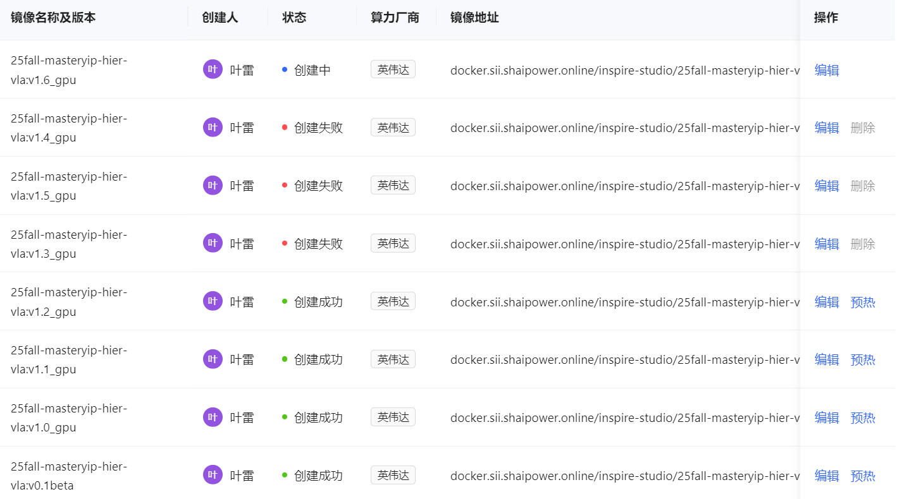
  <br>
  <text>Docker系列镜像</text>
</p>

### 2.2. 代码管理与协作 (Code Management)

基于`RoboTwin`开源代码仓库，创建`RoboTwin_HierVLA`新仓库，进行代码版本控制与协作开发。

<p align="center">
  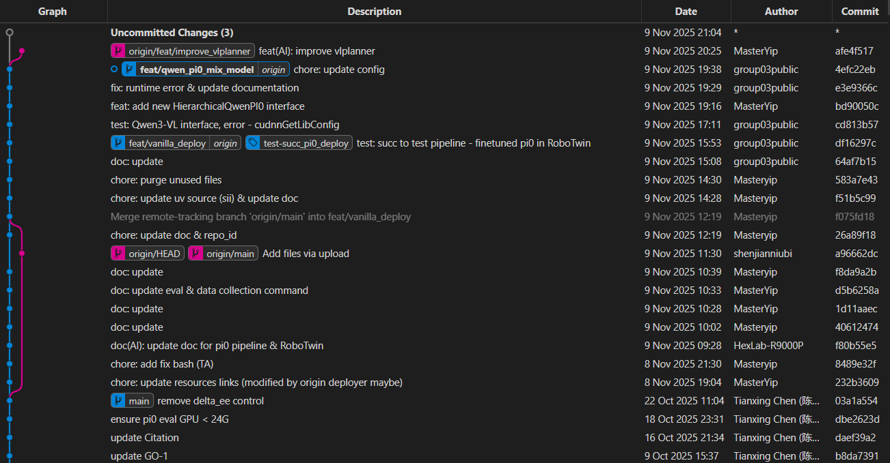
  <br>
  <text>Docker系列镜像</text>
</p>

### 2.3. Xmind思维导图工作流 (Xmind Workflow)

基于Xmind思维导图，规划项目工作流与任务分配，确保各成员明确职责与时间节点。

<p align="center">
  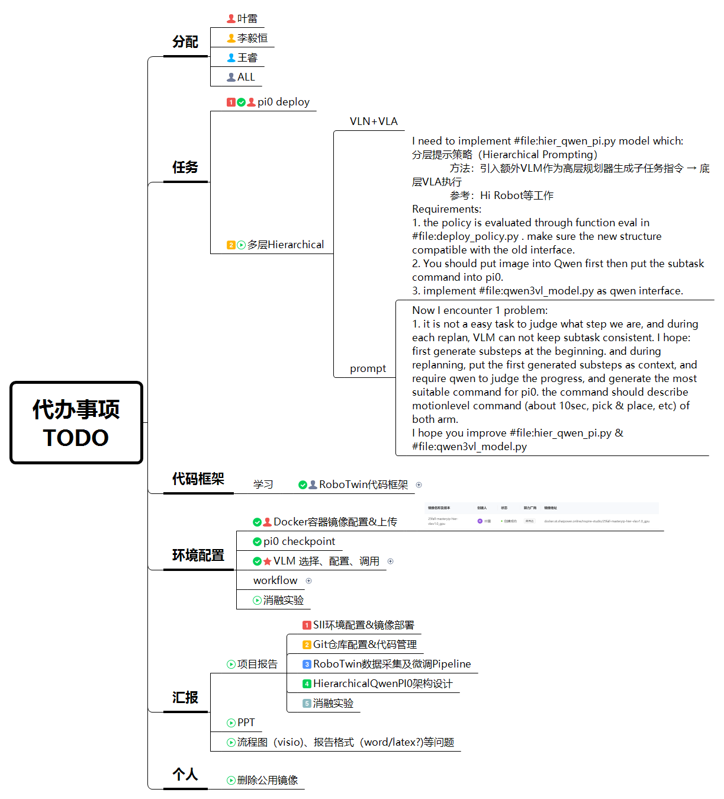
  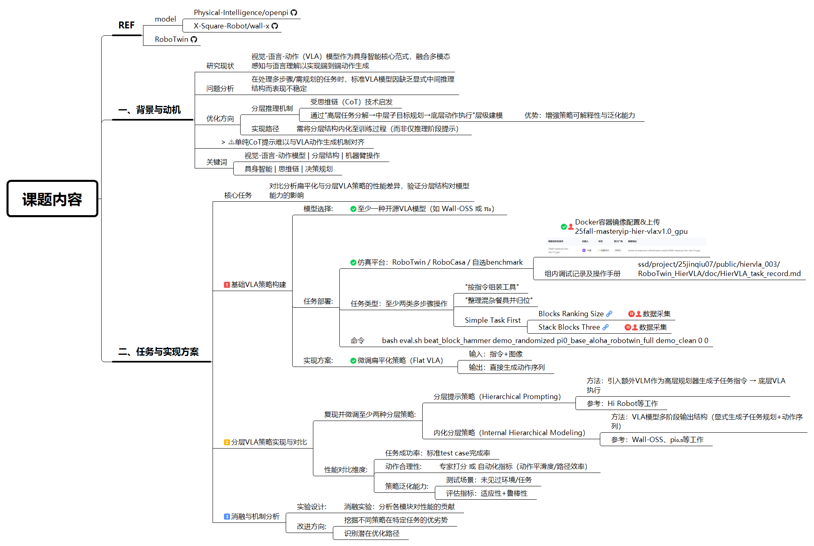
  <br>
  <text>Xmind思维导图工作流</text>
</p>

### 2.4. 数据采集与微调管线搭建 (Data Collection & Fine-tuning Pipeline)

> [!NOTE]
> Checkout Pi0 train data gen & training command see <https://robotwin-platform.github.io/doc/usage/Pi0.html#1-environment-setup>

**Data Collection**

```bash
# Under RoboTwin_HierVLA root directory
bash collect_data.sh stack_blocks_three demo_randomized 0
bash collect_data.sh blocks_ranking_rgb demo_randomized 1
```

**Convert Data to pi0 training data**

```bash
# Under RoboTwin_HierVLA/policy/pi0 directory
mkdir processed_data && mkdir training_data
# bash process_data_pi0.sh ${task_name} ${task_config} ${expert_data_num}
bash process_data_pi0.sh stack_blocks_three demo_randomized 50

# hdf5_path: The path to the generated HDF5 data (e.g., ./training_data/${model_name}/)
# bash generate.sh ${hdf5_path} ${repo_id}
bash generate.sh ./training_data/flatpi0/ flatpi0
```

**Finetune Model**

> In `RoboTwin_HierVLA/policy/pi0/src/openpi/training/config.py`, you only need to write repo_id on your datasets.(e.g., repo_id=demo_clean_repo)

> [!WARNING]
> Change UV source for uv update:
>
> ```bash
> export UV_INDEX_URL=http://nexus.sii.shaipower.online/repository/pypi/simple/
> ```
>
> Update openpi cache path by
>
> ```bash
> export OPENPI_DATA_HOME=/inspire/ssd/project/25jinqiu07/public/hiervla_003/RoboTwin_HierVLA/.cache/openpi
> ```
>
> AND you should put `paligemma_tokenizer` and `pi0_base` into the cache folder.

```bash
# compute norm_stat for dataset
# uv run scripts/compute_norm_stats.py --config-name ${train_config_name}
uv run scripts/compute_norm_stats.py --config-name pi0_base_aloha_robotwin_full

# bash finetune.sh ${train_config_name} ${model_name} ${gpu_use}
bash finetune.sh pi0_base_aloha_robotwin_full flatpi0 0,1,2,3
```

**Eval Trained Pi0 Model Commands**

```bash
# Under RoboTwin_HierVLA/policy/pi0 directory
bash eval.sh ${task_name} ${task_config} ${train_config_name} ${model_name} ${seed} ${gpu_id}
bash eval.sh place_burger_fries demo_randomized pi0_base_aloha_robotwin_full flatpi0 0 0
```

---

## 3. 基线 VLA 策略 (Baseline: Flat VLA)

<p align="center">
  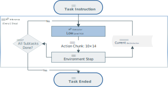
  <br>
  <text>基线 VLA 策略</text>
</p>

我们选用`pi0_base`预训练模型，并在`RoboTwin`平台的`demo_randomized`环境下进行微调，作为扁平化VLA策略的基线实现。该模型直接将视觉、语言和状态输入映射为动作输出，适用于多种操作任务。

---

## 4. 单次规划 VLM-VLA 策略 (Single-Stage VLM-VLA Strategies)

<p align="center">
  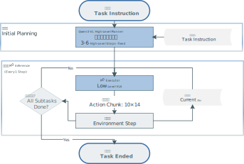
  <br>
  <text>单次规划 VLM-VLA 策略</text>
</p>

单次规划策略是分层VLA的一种简化实现方案，采用"一次性规划+顺序执行"的工作模式。与传统扁平化VLA相比，该策略引入了显式的任务分解环节，但相较于完整的两阶段规划机制，其规划过程仅在任务开始时执行一次。

**工作流程**

在任务执行前，系统调用Qwen3-VL-8B视觉-语言模型，输入主任务指令（如"整理桌面物品"）和初始视觉观测，要求模型生成一个固定的子任务序列。例如，模型可能将任务分解为：1) 识别并定位目标物体；2) 左臂抓取盘子；3) 右臂抓取杯子；4) 双臂协同移动至目标位置；5) 释放物体并归位。生成的子任务列表按照预设的执行步数（如每个子任务50步）依次传递给底层PI0执行器。底层执行器将每个子任务的文本描述作为语言条件，结合当前视觉观测和关节状态，生成对应的关节动作序列。

**技术特点**

该策略的核心优势在于其简洁性和可预测性。由于规划过程仅执行一次，系统避免了重复调用VLM带来的推理开销，推理延迟相较于扁平化基线仅增加初始的一次VLM调用（约1-2秒）。在执行阶段，系统完全依赖预先生成的子任务序列和固定的步数分配策略，不进行任何动态调整。这种设计使得系统行为高度可重现，便于调试和性能分析。

**局限性分析**

单次规划策略存在明显的鲁棒性短板。首先，固定的子任务执行步数无法适应实际执行速度的差异——简单的抓取动作可能在20步内完成，而复杂的双臂协同操作可能需要80步以上。其次，由于缺乏执行过程中的反馈机制，系统无法感知子任务是否真正完成。若某个子任务因环境干扰未能按时完成，后续子任务仍会按照预定计划强制推进，导致任务失败。第三，初始规划基于任务开始时的单一观测，无法预见执行过程中的意外情况（如物体滑落、碰撞干扰等），缺乏应变能力。

---

## 4. 基于视觉反馈的 VLM-VLA 策略 (Vision-feedback Hierarchical VLM-VLA Strategies)

### 4.1. 整体架构设计 (Architecture Design)

分层VLA策略采用**两阶段规划执行框架**，将传统扁平化VLA的单一映射过程解耦为"高层规划"与"低层执行"两个独立模块。该架构的核心思想是：利用大型视觉-语言模型（VLM）的强大理解与推理能力进行任务分解，同时保留底层VLA模型在精细运动控制上的优势。

**架构层次划分：**

* **高层规划器（High-Level Planner）**：基于**Qwen3-VL-8B-Instruct**视觉-语言模型，负责理解复杂任务指令并进行阶段性分解。
* **低层执行器（Low-Level Executor）**：使用**微调PI0模型**，负责将高层规划生成的运动级指令转化为精确的关节动作序列。

该设计参考了Hi Robot等工作中的分层提示策略（Hierarchical Prompting），但在实现上进行了针对性改进，以解决传统分层方法中存在的计划一致性问题。

<p align="center">
  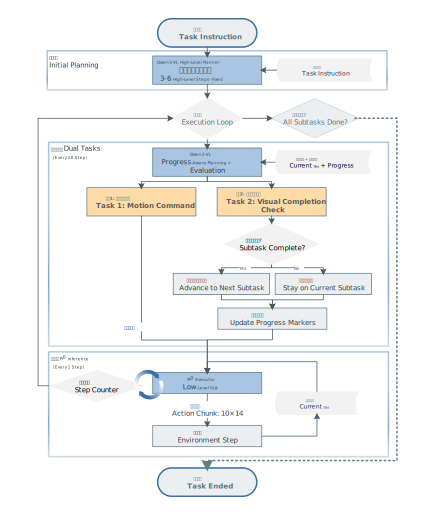
  <br>
  <text>基于视觉反馈的 VLM-VLA 策略</text>
</p>

### 4.3. 两阶段规划机制 (Two-Phase Planning Mechanism)

本实现采用创新的两阶段规划机制，结合**基于感知的进度评估（Perception-Based Progress Evaluation）**，有效解决了传统分层方法中存在的计划漂移（Plan Drift）和进度判断不准确的问题：

**阶段一：初始高层规划（Initial High-Level Planning）**

在任务开始时，Qwen3-VL接收主任务指令和初始视觉观测，生成一个固定的高层计划（3-6个里程碑式步骤）。例如，对于"整理餐桌"任务，可能生成：

1. 识别并定位餐具位置
2. 左臂抓取盘子，右臂抓取杯子
3. 将餐具移动至收纳区
4. 释放并归位双臂

这一初始计划在整个任务执行过程中保持不变，作为后续所有决策的上下文基准。

**阶段二：进度感知的运动指令生成与完成度评估（Progress-Aware Motion Command Generation with Completion Evaluation）**

在执行过程中，系统每隔N步（默认10步，约1秒）重新调用Qwen3-VL，执行**双重任务**：

1. **生成运动级指令（Motion Command Generation）**
   * 输入包含**初始计划全文**，并标注当前进度（✓已完成、→当前执行、○待执行）
   * 输入包含**当前视觉观测**，用于判断实际执行状态
   * 输出**单一运动级指令**，描述未来约10秒内双臂的具体动作（如"左臂：抓取红色方块。右臂：保持当前姿态"）

2. **评估当前子任务完成度（Subtask Completion Evaluation）**
   * **视觉感知判断**：VLM基于当前图像观测，明确回答当前子任务是否已完成（YES/NO）
   * 输出完成度判断的**视觉依据**（如"红色方块已被抓取并抬起，离开桌面"）
   * 仅当VLM明确判断当前子任务完成时，系统才自动推进至下一子任务

**输出格式示例（Structured Output）：**

```
MOTION_COMMAND: Left arm: approach and grasp the red block. Right arm: maintain current position.
SUBTASK_COMPLETE: NO
COMPLETION_REASONING: The red block is still on the table surface, not yet grasped by the gripper.
PROGRESS_SUMMARY: Approaching target object, grasp action in progress.
```

这种设计确保了：

1. **一致性（Consistency）**：所有运动指令都参考同一份初始计划，避免了重复规划导致的目标漂移。
2. **适应性（Adaptability）**：通过视觉反馈动态调整运动细节，应对执行偏差。
3. **准确性（Accuracy）**：基于视觉感知的完成度判断，比固定步数更可靠，能适应不同执行速度和意外情况。
4. **可解释性（Interpretability）**：显式的进度标注和完成度推理使得调试和干预成为可能。

### 4.4. 代码实现细节 (Implementation Details)

分层VLA策略的实现主要包含三个核心模块，分别负责高层规划、策略协调和部署接口。

**1. Qwen3VL高层规划器 (`qwen3vl_model.py`)**

该模块封装了Qwen3-VL-8B-Instruct视觉-语言模型，实现任务分解和进度评估功能。模块在初始化时加载模型，支持自动设备映射和混合精度推理，单卡显存占用约8GB。**核心功能包括**：在任务开始时根据初始观测生成3-6步的高层计划；在执行过程中每隔N步同时完成两项任务——生成下一阶段的运动级指令，以及基于当前视觉观测评估子任务完成度。模块通过精心设计的提示词工程，要求VLM严格输出结构化格式（包含动作指令、完成度判断YES/NO、视觉推理依据、进度摘要），并采用多重解析策略（正则表达式、关键词匹配、默认值兜底）保证输出稳定性。

**2. 分层策略协调器 (`hier_qwen_pi.py`)**

该模块定义了分层策略的主控制器，负责整合高层规划器与底层PI0执行器。在初始化阶段同时加载两个模型并设置重规划频率参数。在任务执行时，协调器首先调用规划器生成固定的高层计划，之后根据步数计数器定期调用规划器进行运动指令生成和完成度评估。当VLM判断当前子任务已完成时，协调器自动推进至下一子任务并重新生成对应的运动指令。协调器将生成的运动指令作为语言输入传递给底层PI0执行器，由其生成具体的关节动作序列。整个过程中维护总步数、当前指令执行步数、规划状态等关键变量。

**3. 策略工厂接口 (`deploy_policy.py`)**

该模块在原有PI0模型加载逻辑基础上增加了分层策略的切换分支。通过配置参数`hierarchical=True`即可从扁平化VLA切换至分层VLA，无需修改评估脚本和环境交互代码。分层策略类严格实现了与PI0基线一致的公共接口，包括观测窗口管理、语言指令设置、动作生成等方法，确保两种策略可在同一套测试框架下进行公平对比。

**接口兼容性与鲁棒性保证**

所有分层策略模块均遵循与扁平化PI0模型一致的接口规范，支持观测更新、动作生成、状态重置等标准操作。针对VLM输出不稳定的问题，实现了多层级解析策略和默认值兜底机制，确保即使模型偶尔输出格式不规范，系统仍能稳定运行而不会崩溃或错误推进子任务。

---

## 5. 性能基准测试系统 (Performance Benchmarking System)

### 5.1. 基准测试框架概述 (Benchmark Framework Overview)

为了系统性地评估不同VLA策略的性能，我们开发了一套自动化的基准测试框架。该框架不仅记录传统的成功率指标，还引入了多维度的定量评估体系，包括动作平滑度、执行效率、系统鲁棒性等关键指标。

### 5.2. 核心模块设计 (Core Module Design)

基准测试系统由三个核心类组成，位于 `envs/utils/benchmark.py`：

#### 1. EpisodeBenchmark 类 (Episode-Level Tracker)

**功能**: 追踪单个任务执行过程中的所有细粒度指标。

**关键属性**:

```python
class EpisodeBenchmark:
    # 基本信息
    episode_id: int          # 试验编号
    seed: int                # 随机种子
    task_name: str           # 任务名称
    instruction: str         # 语言指令
    
    # 执行结果
    success: bool            # 是否成功
    completion_steps: int    # 完成步数
    step_limit: int          # 步数上限
    duration_seconds: float  # 执行时长
    
    # 动作轨迹数据
    actions: List[ndarray]         # 每步的动作向量
    joint_states: List[ndarray]    # 每步的关节状态
    
    # 平滑度指标
    action_velocities: List[ndarray]     # 动作变化率
    joint_accelerations: List[ndarray]   # 关节加速度
    
    # 异常统计
    planning_failures: int   # 规划失败次数
    collision_count: int     # 碰撞次数
```

#### 2. PolicyBenchmark 类 (Policy-Level Aggregator)

**功能**: 聚合多个episode的数据，计算整体统计指标。

**核心方法**:

* `start_episode()`: 开始新的episode追踪
* `record_step()`: 转发给当前episode的tracker
* `mark_episode_success()`: 标记episode完成并保存结果
* `compute_aggregate_metrics()`: 计算聚合统计量

**聚合指标示例**:

```python
{
    "policy_name": "pi0",
    "task_config": "demo_randomized",
    "ckpt_setting": "flatpi0_multask",
    "total_episodes": 2,
    "success_metrics": {
        "success_rate": 0.85,           # 成功率 85%
        "success_count": 85,
        "failure_count": 15
    },
    "step_metrics": {
        "mean_steps": 127.3,            # 平均步数
        "std_steps": 23.5,              # 步数标准差
        "min_steps": 89,                # 最少步数
        "max_steps": 200,               # 最多步数
        "mean_steps_successful": 115.2  # 成功case平均步数
    },
    "smoothness_metrics": {
        "mean_overall_smoothness": 0.78,    # 平均平滑度
        "mean_action_smoothness": 0.82,     # 动作平滑度
        "mean_joint_smoothness": 0.74,      # 关节平滑度
        "mean_action_change": 0.023         # 平均动作变化量
    },
    "robustness_metrics": {
        "mean_planning_failures": 0.12,     # 平均规划失败次数
        "total_planning_failures": 12,
        "mean_collisions": 0.03,            # 平均碰撞次数
        "total_collisions": 3
    }
}

```

### 5.3. 平滑度评估算法 (Smoothness Evaluation Algorithm)

平滑度是评估机器人动作质量的关键指标。我们采用多层次的平滑度计算方法：

**层次 1: 动作层平滑度 (Action-Level Smoothness)**

基于相邻时间步的动作变化量：

$$
\text{ActionVelocity}_t = |a_t - a_{t-1}|
$$

$$
\text{ActionSmoothnessScore} = \frac{1}{1 + \text{Var}(\text{ActionVelocity})}
$$

* 低方差 → 动作变化平稳 → 高平滑度分数
* 高方差 → 动作变化剧烈 → 低平滑度分数

**层次 2: 关节层平滑度 (Joint-Level Smoothness)**

基于关节加速度（二阶导数）：

$$
\text{JointAcceleration}_t = |(q_t - q_{t-1}) - (q_{t-1} - q_{t-2})|
$$

$$
\text{JointSmoothnessScore} = \frac{1}{1 + \text{Var}(\text{JointAcceleration})}
$$

* 低加速度方差 → 运动轨迹平滑 → 高平滑度分数
* 高加速度方差 → 运动抖动明显 → 低平滑度分数

**层次 3: 综合平滑度 (Overall Smoothness)**

$$
\text{OverallSmoothness} = \frac{\text{ActionSmoothnessScore} + \text{JointSmoothnessScore}}{2}
$$

**实际意义**:

* 分数 > 0.8: 运动非常平滑，接近人类操作水平
* 分数 0.6-0.8: 运动较平滑，可接受
* 分数 < 0.6: 运动抖动明显，需要优化

---

## 6. 性能对比 (Performance Comparison)

### 6.1. 实验1：分层VLA策略对比 (Experiment 1: Hierarchical VLA Strategy Comparison)

**基础模型配置**

| 项目 | 详情 |
|:---|:---|
| 基础模型 | PI0 (PaliGemma-based VLA) |
| 微调数据 | 10,000个episode |
| 数据集构成 | 多任务混合训练 |
| 任务类型 | 几个 `demo_clean` 和 `demo_randomized` 混合任务数据 |
| 微调配置 | `pi0_base_aloha_robotwin_full` |

**参与对比的策略**

| 策略名称 | 简称 | 说明 | 核心特点 |
|:---|:---|:---|:---|
| 扁平化VLA (基线) | **Flat VLA** | 微调后的PI0直接推理 | 端到端映射，无高层规划 |
| 单次规划VLM-VLA | **Sim VLA** | 任务开始时一次性分解，按固定步数执行 | 一次性VLM调用，固定步数分配 |
| 基于视觉反馈的VLM-VLA(**老版本**) | **Hier VLA** | 定期重规划+视觉感知完成度评估 | 动态重规划，基于视觉反馈推进 |

**实验场景与任务**

| 测试环境 | 任务 | 说明 |
|:---|:---|:---|
| `demo_randomized` | place_burger_fries-demo_randomized-50 | 将薯条和汉堡放入托盘 |


**实验数据**

详见 [`data/VLA_compare.csv`](./data/VLA_compare.csv)

<p align="center">
  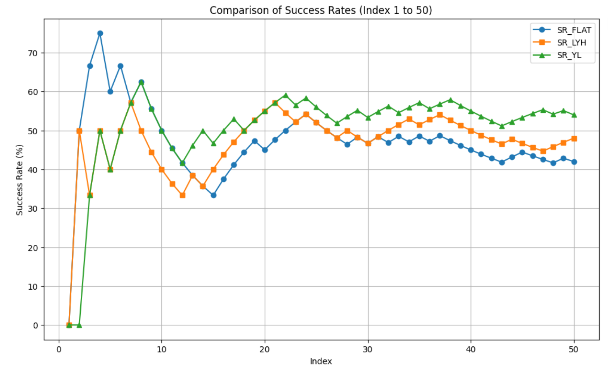
  <br>
  <text>实验1 - 三种VLA策略性能对比</text>
</p>

> 图中**SR_FLAT**代表基线**Flat VLA**的任务成功率，**SR_LYH**代表**单次规划VLM-VLA**的成功率，**SR_YL**代表**基于视觉反馈的VLM-VLA**成功率。

**简要分析**

Flat VLA效果最差，Sim VLA有所提升，Hier VLA表现最佳。可见分层结构和视觉反馈机制提升了任务成功率。

### 实验2


**基础模型配置**
| 项目 | 详情 |
|:---|:---|
| 基础模型 | PI0 (PaliGemma-based VLA) |
| 微调数据 | 30,000个episode |
| 数据集构成 | 单任务训练 |
| 任务类型 | `place_burger_fries-demo_randomized-50` |
| 微调配置 | `pi0_base_aloha_robotwin_full` |

**参与对比的策略**

| 策略名称 | 简称 | 说明 | 核心特点 |
|:---|:---|:---|:---|
| 扁平化VLA (基线) | **Flat VLA** | 微调后的PI0直接推理 | 端到端映射，无高层规划 |
| 基于视觉反馈的VLM-VLA(**新版本**) | **Hier VLA** | 定期重规划+视觉感知完成度评估 | 动态重规划，基于视觉反馈推进 |

**实验场景与任务**

| 测试环境 | 任务 | 说明 |
|:---|:---|:---|
| `demo_randomized` | place_burger_fries-demo_randomized-50 | 将薯条和汉堡放入托盘 |


**数据分析**
<p align="center">
  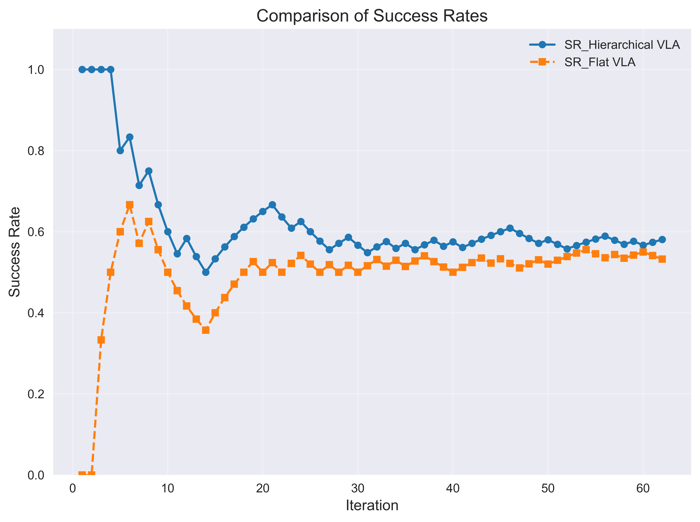
  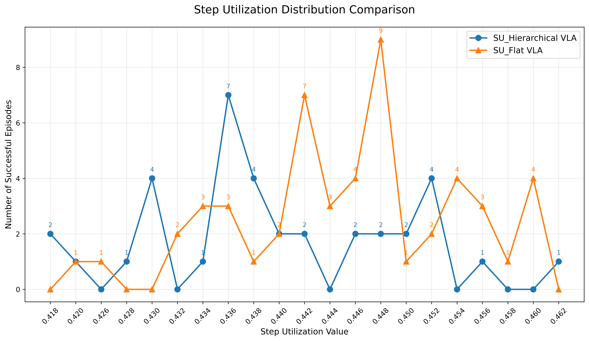
</p>

图中SR代表任务成功率，SU代表平均完成速度（所用步数/总步数上限）。
多层VLM-VLA结构能够提高成功率，并且平均完成速度更快。

### 实验3

**基础模型配置**
| 项目 | 详情 |
|:---|:---|
| 基础模型 | PI0 (PaliGemma-based VLA) |
| 微调数据 | 10,000个episode |
| 数据集构成 | 4个`demo_randomized`任务 |
| 任务类型 | `blocks_ranking_rgb` `place_burger_fries` `place_cans_plasticbox` `shake_bottle` |
| 微调配置 | `pi0_base_aloha_robotwin_full` |

**参与对比的策略**

| 策略名称 | 简称 | 说明 | 核心特点 |
|:---|:---|:---|:---|
| 扁平化VLA (基线) | **Flat VLA** | 微调后的PI0直接推理 | 端到端映射，无高层规划 |
| 基于视觉反馈的VLM-VLA(**新版本**) | **Hier VLA** | 定期重规划+视觉感知完成度评估 | 动态重规划，基于视觉反馈推进 |

**实验场景与任务**

| 测试环境 | 任务 | 说明 |
|:---|:---|:---|
| `demo_randomized` | place_burger_fries-demo_randomized-50 | 将薯条和汉堡放入托盘 |

**数据分析**
<p align="center">
  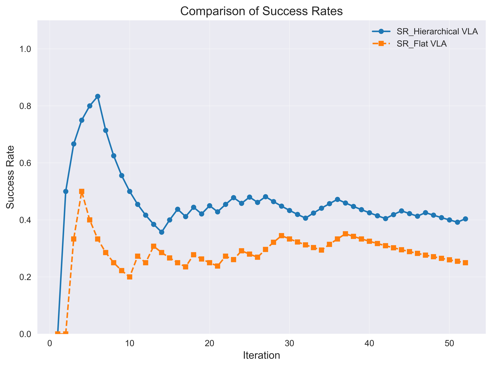
  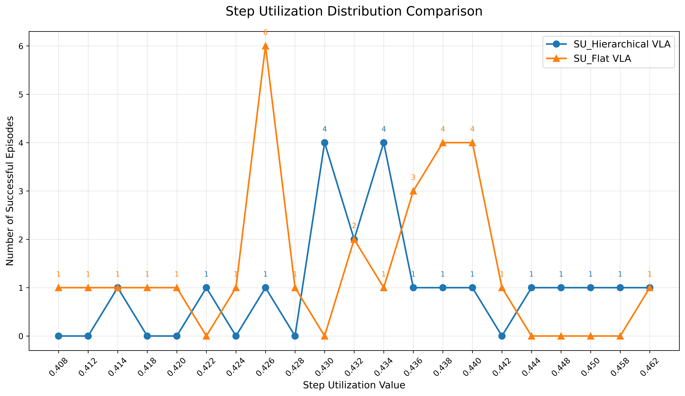
</p>

图中SR代表任务成功率，SU代表平均完成速度（所用步数/总步数上限）。
本实验中多层VLM-VLA结构在多任务混合训练下，依然能够显著提升成功率，且较**实验2**中过拟合的模型效果提升更多。平均完成速度差距不大。

### 实验4

我们对三种策略实现进行了对比实验：
<p align="center">
  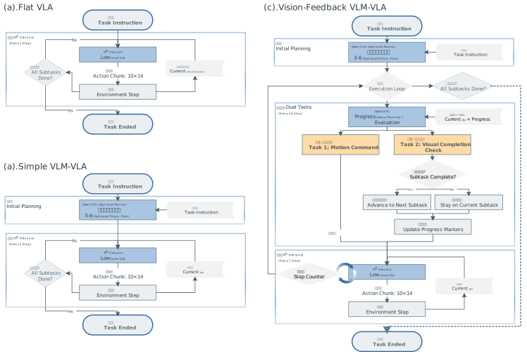
  <br>
  <text>参与对比的策略。(a)FlatVLA为基线策略。 (b)Simple VLM-VLA进行了任务格式化分解。(c)Vision-Feedback VLM-VLA接入了重规划和视觉闭环 </text>
</p>

#TODO

### 6.2. 评估维度 (Evaluation Metrics)

我们将根据 `05-evaluation-pipeline.md` 文档，从以下三个维度进行评估：

#### 1. 任务成功率 (Task Success Rate)

* **指标**: `success_rate`。
* **测试用例 (Test Cases)**:
  * Blocks Ranking Size: `___________`
  * Stack Blocks Three: `___________`
  * Complex Task 1 (Assemble tools): `___________`
  * Complex Task 2 (Organize utensils): `___________`

#### 2. 动作合理性 (Action Rationality / Quality)

* **指标 1 (效率)**: `average_steps` (平均步数) 和 `completion_time` (平均完成时间)。
* **指标 2 (平滑度)**: `action_smoothness`。
* **结果**:
  * 平均步数: `___________`
  * 动作平滑度: `___________`

#### 3. 策略泛化能力 (Generalization Capability)

* **方法**: 跨域评估（Cross-Domain Evaluation）。
* **测试**: 使用在 `demo_clean` (干净) 配置下训练的模型，在 `demo_randomized` (视觉/物理随机化) 或 `hard_randomized` (困难随机化) 配置下进行评估。
* **指标**: 成功率下降幅度。
* **结果**:
  * *Clean -> Randomized 成功率*: `___________`

### 6.3. 结果汇总表 (Results Summary)

| 策略 (Strategy) | 成功率 (SR) (简单任务) | 成功率 (SR) (复杂任务) | 动作质量 (平滑度/效率) | 泛化能力 (SR in Randomized) |
|:--- |:--- |:--- |:--- |:--- |
| **Flat VLA (基线)** | `___________` | `___________` | `___________` | `___________` |
| **Strategy 1 (外部)** | `___________` | `___________` | `___________` | `___________` |
| **Strategy 2 (内部)** | `___________` | `___________` | `___________` | `___________` |

---

## 7. 消融与机制分析 (Ablation Studies & Analysis)

### 7.1. 消融实验 (Ablation Experiments)

* **实验 1: 规划器 vs 执行器 (Planner vs. Executor)**
  * *目的*: 验证 `TaskDecompositionModule` (高层规划器) 的必要性。
  * *设置*: 仅使用 `Strategy 1`，将其中的高层规划器替换为一个“扁平”的指令（即直接将原始复杂指令"整理餐桌"喂给`GraspController`）。
  * *预期*: 任务失败，证明高层规划器对于理解复杂指令至关重要。
  * *结果*: `___________`

* **实验 2: 专用技能 vs 通用技能 (Specialized vs. General Skills)**
  * *目的*: 验证 `SkillController` 模块化的优势。
  * *设置*: 在 `Strategy 2` 中，将所有专用的 `SkillController` (Reach, Grasp, Place) 替换为同一个 `Flat VLA` (PI0基线) 来执行所有子任务。
  * *预期*: 成功率下降，或样本效率降低。证明专用技能控制器在学习效率和鲁棒性上的优势。
  * *结果*: `___________`

### 7.2. 洞察与改进 (Insights & Improvements)

* **优势与权衡 (Strengths & Weaknesses)**:
  * **Flat VLA**:
    * *优势*: 结构简单，端到端。
    * *劣势*: 可解释性差，难以调试，泛化能力弱，样本效率低。
  * **Hierarchical (分层策略)**:
    * *优势*: **可解释性强** (显式的子目标)；**样本效率高** (模块化学习，预期2-3倍提升)；**泛化性强** (技能可组合、可复用)；**易于调试**。
    * *权衡 (Trade-off)*: 增加了**推理开销** (约 20ms) 和 **GPU显存占用** (约 1GB)。

* **未来改进路径 (Optimization Paths)**:
  * **Phase 2**: 扩展技能库（`SkillController`），支持工具使用、双臂协同；实现动态重规划（Dynamic Re-planning）。
  * **Phase 3**: 实现技能的在线学习（Online Adaptation）和从演示中学习（Learning from Demonstrations）。

---

## 8. 时间线与里程碑 (Timeline & Milestones)

* [x] 环境搭建与数据收集脚本分析 (`T=0-2h`)
* [ ] 基线 Flat VLA 训练与评估 (`T=2-12h`)
* [ ] 分层策略 1 (外部) 实现与调试 (`T=6-24h`)
* [ ] 分层策略 2 (内部) 数据准备与实现 (`T=6-30h`)
* [ ] 性能评估与数据汇总 (`T=30-40h`)
* [ ] 消融实验 (`T=40-44h`)
* [ ] 最终分析与报告撰写 (`T=44-48h`)

---

## 9. 备注与问题记录 (Notes & Issues)

### 9.3. 参考资料 (References)

* [1] RoboTwin2 Official Doc: <https://robotwin-platform.github.io/doc/usage/index.html>
* [2] DeepWiki: <https://deepwiki.com/RoboTwin-Platform/RoboTwin>
