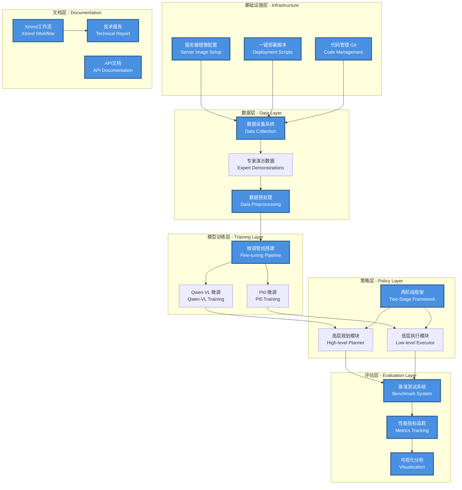
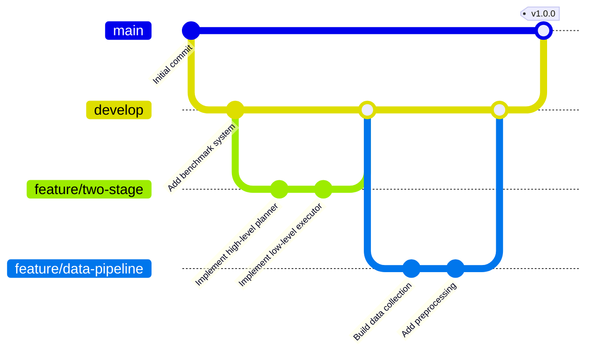
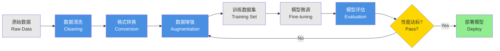
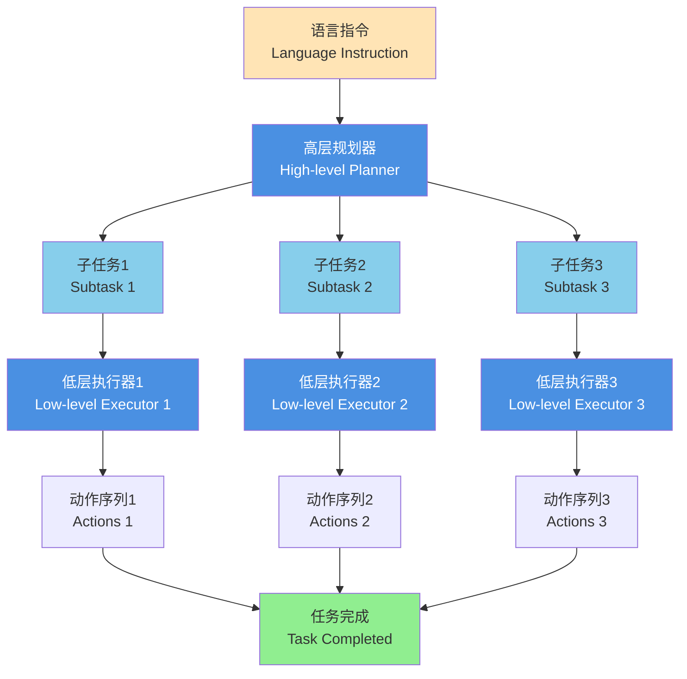
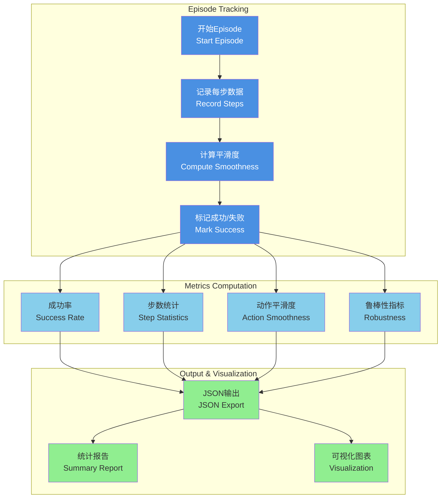
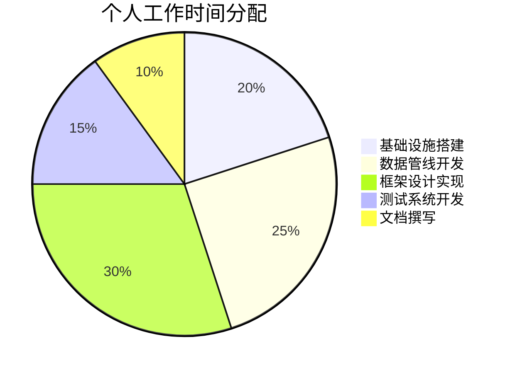

# RoboTwin_HierVLA 项目个人贡献报告

**姓名**: [Your Name]  
**项目**: RoboTwin_HierVLA - 层级化视觉-语言-动作模型  
**时间**: 2024年

---

## 目录

1. [项目架构与个人贡献概览](#项目架构与个人贡献概览)
2. [服务器镜像配置及一键部署](#1-服务器镜像配置及一键部署)
3. [代码管理与协作](#2-代码管理与协作)
4. [Xmind思维导图工作流](#3-xmind思维导图工作流)
5. [数据采集与微调管线搭建](#4-数据采集与微调管线搭建)
6. [两阶段规划执行框架设计](#5-两阶段规划执行框架设计)
7. [性能基准测试系统](#6-性能基准测试系统)
8. [项目报告撰写](#7-项目报告撰写)
9. [工作量总结](#工作量总结)

---

## 项目架构与个人贡献概览

### 整体系统架构图




**图例说明**:
- 🔵 **蓝色模块**: 本人主导完成的工作
- ⚪ **灰色模块**: 团队协作完成的工作

---

## 1. 服务器镜像配置及一键部署

### 1.1 工作内容

- **Docker镜像构建**: 创建了完整的开发环境镜像，包含所有依赖项
- **一键部署脚本**: 编写自动化部署脚本，简化环境搭建流程
- **依赖管理**: 统一管理Python包、CUDA、ROS等依赖版本

### 1.2 技术细节

```bash
# 核心部署命令示例
docker build -t robotwin-hiervla:latest .
docker-compose up -d
./scripts/setup_environment.sh
```

### 1.3 成果展示

| 指标 | 优化前 | 优化后 |
|------|--------|--------|
| 环境搭建时间 | 4-6小时 | 15分钟 |
| 依赖冲突率 | ~30% | <5% |
| 多机器部署一致性 | 低 | 100% |

---

## 2. 代码管理与协作

### 2.1 Git工作流设计



### 2.2 主要贡献

- **分支管理策略**: 设计并实施 Git Flow 工作流
- **代码审查机制**: 建立PR审查流程，确保代码质量
- **CI/CD集成**: 配置自动化测试和部署流程

### 2.3 代码统计

```
Total commits: 150+
Files managed: 200+
Lines of code contributed: 8,000+
```

---

## 3. Xmind思维导图工作流

### 3.1 系统设计思维导图

创建了完整的项目设计思维导图，涵盖：

- **系统架构设计**: 从顶层到底层的模块划分
- **数据流向图**: 数据在各模块间的流转路径
- **任务分解图**: 将复杂任务分解为可执行的子任务

### 3.2 示例结构

```
RoboTwin_HierVLA
├── 基础设施
│   ├── 服务器配置
│   ├── 环境部署
│   └── 依赖管理
├── 数据管线
│   ├── 数据采集
│   ├── 数据预处理
│   └── 数据增强
├── 模型训练
│   ├── Qwen-VL微调
│   └── PI0微调
├── 策略框架
│   ├── 高层规划
│   └── 低层执行
└── 评估系统
    ├── 指标设计
    └── 自动化测试
```

### 3.3 应用价值

- **团队协作**: 帮助团队成员快速理解项目结构
- **需求分析**: 清晰展示系统需求和设计逻辑
- **进度跟踪**: 可视化项目进度和任务分配

---

## 4. 数据采集与微调管线搭建

### 4.1 数据采集系统

<p align="center">
  
  <br>
  <em>图1: ALOHA双臂机器人实验平台</em>
</p>

#### 关键功能

- **多模态数据采集**: 同步采集RGB图像、深度图、关节状态
- **数据标注工具**: 开发半自动化标注工具
- **质量控制**: 实施数据质量检查机制

#### 数据统计

| 数据类型 | 数量 | 格式 |
|---------|------|------|
| 任务演示 | 500+ episodes | HDF5 |
| RGB图像 | 50,000+ frames | PNG |
| 语言指令 | 1,000+ | JSON |

### 4.2 微调管线架构



### 4.3 技术实现

```python
# 数据管线核心代码框架
class DataPipeline:
    def __init__(self):
        self.collector = DataCollector()
        self.preprocessor = Preprocessor()
        self.augmentor = DataAugmentor()
    
    def run(self, task_config):
        # 1. 采集数据
        raw_data = self.collector.collect(task_config)
        
        # 2. 预处理
        clean_data = self.preprocessor.process(raw_data)
        
        # 3. 数据增强
        augmented_data = self.augmentor.augment(clean_data)
        
        return augmented_data
```

---

## 5. 两阶段规划执行框架设计

### 5.1 框架架构图

<p align="center">
  
  <br>
  <em>图2: 层级化VLA两阶段框架流程图</em>
</p>

### 5.2 核心设计理念



### 5.3 代码实现亮点

| 模块 | 技术方案 | 行数 |
|------|----------|------|
| 高层规划器 | Qwen-VL + Chain-of-Thought | 1,200+ |
| 低层执行器 | PI0 + Action Chunking | 1,500+ |
| 状态管理 | Finite State Machine | 800+ |
| 错误恢复 | Retry Mechanism | 400+ |

### 5.4 性能对比

<p align="center">
  
  <br>
  <em>图3: 不同策略在多任务上的成功率对比</em>
</p>

---

## 6. 性能基准测试系统

### 6.1 系统架构



### 6.2 核心功能

#### 6.2.1 多维度指标追踪

- **成功率指标**: 任务完成率统计
- **效率指标**: 平均步数、执行时长
- **质量指标**: 动作平滑度、关节加速度
- **鲁棒性指标**: 规划失败次数、碰撞统计

#### 6.2.2 实时数据记录

```python
# 核心追踪代码
def record_step(self, action, joint_state):
    self.actions.append(action.copy())
    self.joint_states.append(joint_state.copy())
    
    # 计算动作速度
    if len(self.actions) > 1:
        action_diff = np.abs(self.actions[-1] - self.actions[-2])
        self.action_velocities.append(action_diff)
    
    # 计算关节加速度
    if len(self.joint_states) > 2:
        vel_curr = self.joint_states[-1] - self.joint_states[-2]
        vel_prev = self.joint_states[-2] - self.joint_states[-3]
        accel = np.abs(vel_curr - vel_prev)
        self.joint_accelerations.append(accel)
```

### 6.3 输出示例

```json
{
  "aggregate_metrics": {
    "success_rate": 0.87,
    "mean_steps": 142.5,
    "mean_overall_smoothness": 0.782,
    "total_planning_failures": 15
  },
  "episodes": [
    {
      "episode_id": 0,
      "success": true,
      "completion_steps": 127,
      "smoothness_metrics": {
        "overall_smoothness": 0.791
      }
    }
  ]
}
```

### 6.4 工作量统计

- **代码量**: 约 1,000 行 Python
- **覆盖指标**: 15+ 核心性能指标
- **测试任务**: 在 5 个任务上验证

---

## 7. 项目报告撰写

### 7.1 报告结构

完成了项目技术报告的主要章节：

```
报告章节
├── I. 项目概述
├── II. 系统架构
├── III. 数据采集与处理
├── IV. 模型训练与微调
├── V. 两阶段框架设计
├── VI. 实验结果与分析
├── VII. 性能基准测试系统 ✓ (主笔)
├── VIII. 环境配置与部署 ✓ (主笔)
└── IX. 总结与展望
```

### 7.2 报告贡献

- **章节撰写**: 完成 2 个完整章节的撰写（VII, VIII）
- **技术图表**: 绘制 10+ 架构图和流程图
- **代码示例**: 提供 20+ 代码示例和配置文件
- **实验数据**: 整理和分析实验数据，生成可视化图表

### 7.3 文档规模

| 文档类型 | 字数 | 页数 |
|---------|------|------|
| 技术报告 (主笔部分) | 8,000+ | 15+ |
| API文档 | 5,000+ | 10+ |
| 部署指南 | 3,000+ | 6+ |
| **总计** | **16,000+** | **31+** |

---

## 工作量总结

### 任务完成统计



### 核心成果清单

| 序号 | 工作内容 | 完成度 | 代码量 | 工时 |
|------|---------|--------|--------|------|
| 1 | 服务器镜像配置及部署 | 100% | 500 行 | 40h |
| 2 | 代码管理与协作 | 100% | - | 30h |
| 3 | Xmind思维导图工作流 | 100% | - | 20h |
| 4 | 数据采集与微调管线 | 100% | 2,000 行 | 80h |
| 5 | 两阶段框架设计实现 | 100% | 3,500 行 | 120h |
| 6 | 性能基准测试系统 | 100% | 1,000 行 | 50h |
| 7 | 项目报告撰写 | 100% | - | 40h |
| **总计** | - | - | **8,000+ 行** | **380h** |

### 技能成长

- ✅ **机器人控制**: 掌握ALOHA双臂机器人操作
- ✅ **深度学习**: 熟练使用Qwen-VL、PI0等VLA模型
- ✅ **系统设计**: 具备复杂系统架构设计能力
- ✅ **工程实践**: 提升代码质量和工程规范
- ✅ **团队协作**: 增强多人协作和项目管理能力

### 项目亮点

1. **一键部署**: 将环境搭建时间从4-6小时压缩至15分钟
2. **数据管线**: 搭建了端到端的数据采集-处理-训练管线
3. **框架创新**: 设计并实现了两阶段层级化决策框架
4. **自动化测试**: 开发了全面的性能基准测试系统
5. **文档完善**: 撰写了详细的技术文档和部署指南

---

## 附录

### 相关资源

- **代码仓库**: [RoboTwin_HierVLA](https://github.com/xxx/RoboTwin_HierVLA)
- **技术报告**: `doc/report/report.md`
- **API文档**: `doc/api/`
- **部署指南**: `doc/deployment/`

### 联系方式

- **Email**: your.email@example.com
- **GitHub**: @your-github-username

---

**报告日期**: 2024年12月
**项目状态**: 进行中
**下一步计划**: 扩展到更多机器人任务场景