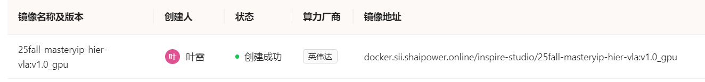

# Group003 项目报告：扁平化与分层VLA策略对比分析

**项目成员:**  叶雷 (镜像搭建以及任务实现)，李毅恒(分层策略以及任务实现), C角 (消融实验以及报告)
**项目周期:** 48小时

---

## I. 项目概览 (Project Overview)

### 1.1. 项目背景与挑战

传统的扁平化VLA（Flat VLA）模型，如`PI0`，采用单一的端到端映射，即 $(\text{Vision}, \text{Language}, \text{State}) \rightarrow \text{Actions}$。这种结构在处理多步骤、长周期的复杂操作任务时，面临以下挑战：
* **可解释性差 (Limited interpretability)**：决策过程是一个“黑盒”，难以调试。
* **学习效率低 (Inefficient learning)**：模型必须从头学习所有行为，难以泛化。
* **泛化能力弱 (Poor generalization)**：难以将学到的技能迁移到新的任务变体中。

### 1.2. 核心任务 (Core Objective)

本项目旨在复现一个扁平化VLA（`PI0`）作为基线（Baseline），并在此基础上，设计、实现并对比两种分层VLA（Hierarchical VLA）策略。

我们将重点评估分层结构在**任务成功率、动作合理性（效率与平滑度）、泛化鲁棒性**方面的提升，并分析其对模型可解释性、样本效率和推理开销的影响。

---

## II. 基线 VLA 策略 (Baseline: Flat VLA)

本部分由**叶雷**同学负责复现，作为后续所有分层策略的“控制组”和“底层执行器”基础。

### 2.1. 模型与环境 (Model & Environment)

* **模型选型 (Model Selection)**: **π₀ (PI0)**。
    * *描述*: PI0 是一个为机器人操作设计的基础视觉-语言-动作模型。它通过一个多模态Transformer骨干网络，融合语言指令、多视角图像和关节状态，以自回归方式生成“动作块”(Action Chunk)。
* **仿真平台 (Platform)**: **RoboTwin**。
    * *描述*: RoboTwin 是一个支持双臂机器人操作的仿真环境。
    * *观测空间*: 多模态输入，包括3个RGB摄像头（Head, Left, Right）和14维的关节状态向量。
* **Docker 镜像 (Image)**: `25fall-masteryip-hier-vla:v1.0_gpu`
    - Image: `25fall-masteryip-hier-vla:v1.0_gpu`
    
### 2.2. 任务类型 (Task Types)

* **简单任务 (Simple Tasks)**:
    * [x] `blocks_ranking_rgb` (按大小排列方块)
    * [x] `stack_blocks_three` (堆叠三个方块)
* **复杂任务 (Complex Tasks)**:
    * [ ] "按指令组装工具" (Assemble tools by instruction)
    * [ ] "整理混杂餐具并归位" (Organize and return utensils)
    * [ ] `beat_block_hammer` (双臂协同任务)

### 2.3. 扁平化策略实现 (Flat VLA Implementation)

* **架构**:
    1.  **输入 (Input)**: 自然语言指令 (`prompt`) + 3路RGB图像 (`cam_high`, `cam_left_wrist`, `cam_right_wrist`) + 14维关节状态 (`state`)。
    2.  **编码 (Encoding)**: Vision Encoder (Vision), Language Encoder (Language), State Encoder (State)。
    3.  **融合 (Fusion)**: Multi-Modal Fusion 模块。
    4.  **核心 (Core)**: Transformer Backbone。
    5.  **输出 (Output)**: Action Decoder 生成 `[Horizon, Action_Dim]` (例如 `[10, 14]`) 的关节速度动作块。
* **训练进展 (Training Progress)**:
    * *数据集准备 (Dataset preparation)*: `pi0_base_aloha_robotwin_full` (使用 `demo_clean` 配置)。
    * *训练状态 (Training status)*: `___________`
    * *基线检查点 (Baseline Checkpoint)*: `___________`

---

## III. 分层 VLA 策略实现 (Hierarchical VLA Strategies)

### 3.1. 策略 1 : 外部规划器 (Hierarchical Prompting)

* **方法 (Method)**: **VLM/LLM as High-Level Planner → VLA as Low-Level Executor**。
    * *描述*: 此方案将“规划”和“执行”解耦。一个高级规划器（LLM）负责将复杂指令分解为简单的子任务序列，然后一个底层的VLA（我们的`PI0`基线模型）负责执行这些简单的子任务。
* **参考 (Reference)**: Hi Robot, `06-hierarchical-modifications.md`。
* **实现笔记 (Implementation Notes)**:
    * **高层规划器 (High-level planner)**: 实现 `TaskDecompositionModule`。
        * *输入*: 高级指令 (e.g., "整理餐桌")。
        * *输出*: 子目标序列 (e.g., `[Navigate(red_block), Grasp(red_block), ...]`)。
        * *状态*: `___________`
    * **底层执行器 (Low-level executor)**: 复用 `PI0` 基线模型，或为其实现专门的 `SkillController`（如 `ReachController`, `GraspController`）。
        * *输入*: 子目标 (e.g., `Grasp(red_block)`) + 观测(Observation)。
        * *输出*: 动作块 (Action Chunk)。
        * *状态*: `___________`
    * **集成状态 (Integration status)**: `___________`
    * **预期挑战**: 推理延迟增加。`Flat PI0` 约 100ms/step，此方案预计增加到 120ms/step (增加了 `TaskDecomposition` 的开销)。

### 3.2. 策略 2 : 内化分层 (Internal Hierarchical Modeling)

* **方法 (Method)**: **Multi-stage VLA output** (模型内部生成子任务规划 + 动作序列)。
    * *描述*: 此方案不依赖外部LLM，而是通过修改模型架构或训练数据，使VLA模型**自身**具备分层规划能力。模型在输出动作前，会先在内部（或显式地）生成子任务规划。
* **参考 (Reference)**: Wall-OSS, π₀.₅。
* **实现笔记 (Implementation Notes)**:
    * **架构设计 (Architecture design)**: 继承 `PI0` 类，构建 `HierarchicalPI0` 类。
        * 重写 `set_language` 方法，使其在接收指令时自动调用 `TaskDecompositionModule`。
        * 重写 `get_action` 方法，使其根据当前子目标，自动选择对应的 `SkillController` 来生成动作。
    * **训练方法 (Training approach)**:
        * *方案*: 采用模块化学习。可能需要使用LLM（如GPT-4）辅助，对现有 `(image, action)` 轨迹数据进行“反向标注”，生成 `(image, sub_goal, action)` 格式的分层数据集。
        * *预期优势*: 相比 `Flat VLA`，样本效率更高（预期2-3倍提升），收敛更快。
    * **状态 (Status)**: `___________`
    * **预期挑战**: GPU显存占用增加。`Flat PI0` 约 4GB，此方案预计 5GB（因为加载了多个 `SkillController`）。

---

## IV. 性能对比 (Performance Comparison)

### 4.1. 评估维度 (Evaluation Metrics)

我们将根据 `05-evaluation-pipeline.md` 文档，从以下三个维度进行评估：

#### 1. 任务成功率 (Task Success Rate)
* **指标**: `success_rate`。
* **测试用例 (Test Cases)**:
    * Blocks Ranking Size: `___________`
    * Stack Blocks Three: `___________`
    * Complex Task 1 (Assemble tools): `___________`
    * Complex Task 2 (Organize utensils): `___________`

#### 2. 动作合理性 (Action Rationality / Quality)
* **指标 1 (效率)**: `average_steps` (平均步数) 和 `completion_time` (平均完成时间)。
* **指标 2 (平滑度)**: `action_smoothness`。
* **结果**:
    * 平均步数: `___________`
    * 动作平滑度: `___________`

#### 3. 策略泛化能力 (Generalization Capability)
* **方法**: 跨域评估（Cross-Domain Evaluation）。
* **测试**: 使用在 `demo_clean` (干净) 配置下训练的模型，在 `demo_randomized` (视觉/物理随机化) 或 `hard_randomized` (困难随机化) 配置下进行评估。
* **指标**: 成功率下降幅度。
* **结果**:
    * *Clean -> Randomized 成功率*: `___________`

### 4.2. 结果汇总表 (Results Summary)

| 策略 (Strategy) | 成功率 (SR) (简单任务) | 成功率 (SR) (复杂任务) | 动作质量 (平滑度/效率) | 泛化能力 (SR in Randomized) |
|:--- |:--- |:--- |:--- |:--- |
| **Flat VLA (基线)** | `___________` | `___________` | `___________` | `___________` |
| **Strategy 1 (外部)** | `___________` | `___________` | `___________` | `___________` |
| **Strategy 2 (内部)** | `___________` | `___________` | `___________` | `___________` |

---

## V. 消融与机制分析 (Ablation Studies & Analysis)

### 5.1. 消融实验 (Ablation Experiments)

* **实验 1: 规划器 vs 执行器 (Planner vs. Executor)**
    * *目的*: 验证 `TaskDecompositionModule` (高层规划器) 的必要性。
    * *设置*: 仅使用 `Strategy 1`，将其中的高层规划器替换为一个“扁平”的指令（即直接将原始复杂指令"整理餐桌"喂给`GraspController`）。
    * *预期*: 任务失败，证明高层规划器对于理解复杂指令至关重要。
    * *结果*: `___________`

* **实验 2: 专用技能 vs 通用技能 (Specialized vs. General Skills)**
    * *目的*: 验证 `SkillController` 模块化的优势。
    * *设置*: 在 `Strategy 2` 中，将所有专用的 `SkillController` (Reach, Grasp, Place) 替换为同一个 `Flat VLA` (PI0基线) 来执行所有子任务。
    * *预期*: 成功率下降，或样本效率降低。证明专用技能控制器在学习效率和鲁棒性上的优势。
    * *结果*: `___________`

### 5.2. 洞察与改进 (Insights & Improvements)

* **优势与权衡 (Strengths & Weaknesses)**:
    * **Flat VLA**:
        * *优势*: 结构简单，端到端。
        * *劣势*: 可解释性差，难以调试，泛化能力弱，样本效率低。
    * **Hierarchical (分层策略)**:
        * *优势*: **可解释性强** (显式的子目标)；**样本效率高** (模块化学习，预期2-3倍提升)；**泛化性强** (技能可组合、可复用)；**易于调试**。
        * *权衡 (Trade-off)*: 增加了**推理开销** (约 20ms) 和 **GPU显存占用** (约 1GB)。

* **未来改进路径 (Optimization Paths)**:
    * **Phase 2**: 扩展技能库（`SkillController`），支持工具使用、双臂协同；实现动态重规划（Dynamic Re-planning）。
    * **Phase 3**: 实现技能的在线学习（Online Adaptation）和从演示中学习（Learning from Demonstrations）。

---

## VI. 时间线与里程碑 (Timeline & Milestones)

- [x] 环境搭建与数据收集脚本分析 (`T=0-2h`)
- [ ] 基线 Flat VLA 训练与评估 (`T=2-12h`)
- [ ] 分层策略 1 (外部) 实现与调试 (`T=6-24h`)
- [ ] 分层策略 2 (内部) 数据准备与实现 (`T=6-30h`)
- [ ] 性能评估与数据汇总 (`T=30-40h`)
- [ ] 消融实验 (`T=40-44h`)
- [ ] 最终分析与报告撰写 (`T=44-48h`)

---

## VII. 备注与问题记录 (Notes & Issues)

### 7.1. 技术问题 (Technical Issues)

1.  **GPU 内存占用 (OOM)**: `Flat PI0` 基线模型推理需要约 4GB 显存。`HierarchicalPI0` (策略2) 因为需要加载多个技能控制器，预计需要 5GB 显存。
2.  **推理延迟 (Inference Latency)**: `Flat PI0` 推理时间约 100ms (`PI0-Base`)。`Strategy 1` (外部) 增加了LLM规划开销，`Strategy 2` (内部) 增加了子任务选择开销，总延迟预计为 120ms。

### 7.2. 解决方案 (Solutions & Workarounds)

1.  **内存管理**: 严格遵守 `eval.sh` 中的 `XLA_PYTHON_CLIENT_MEM_FRACTION=0.4` 设置，限制JAX/TensorFlow仅使用 40% 的显存，防止OOM。
2.  **延迟优化**: 如果延迟成为瓶颈，可考虑将模型从 `PI0-Base` (100ms) 切换为 `PI0-FAST` (50ms)，以抵消分层带来的开销。

### 7.3. 参考资料 (References)

* [1] RoboTwin2 Official Doc: https://robotwin-platform.github.io/doc/usage/index.html
* [2] DeepWiki: https://deepwiki.com/RoboTwin-Platform/RoboTwin
* [3] 项目文件1-6